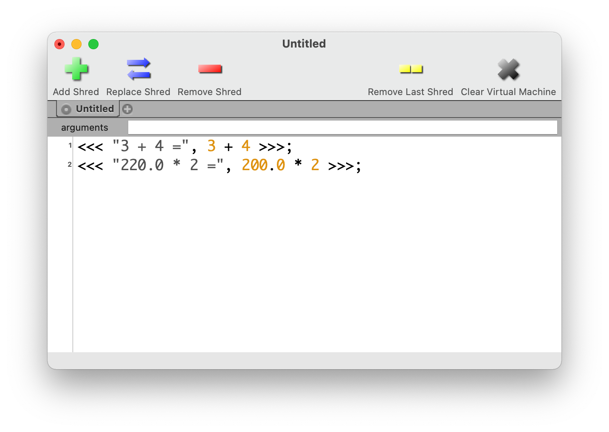
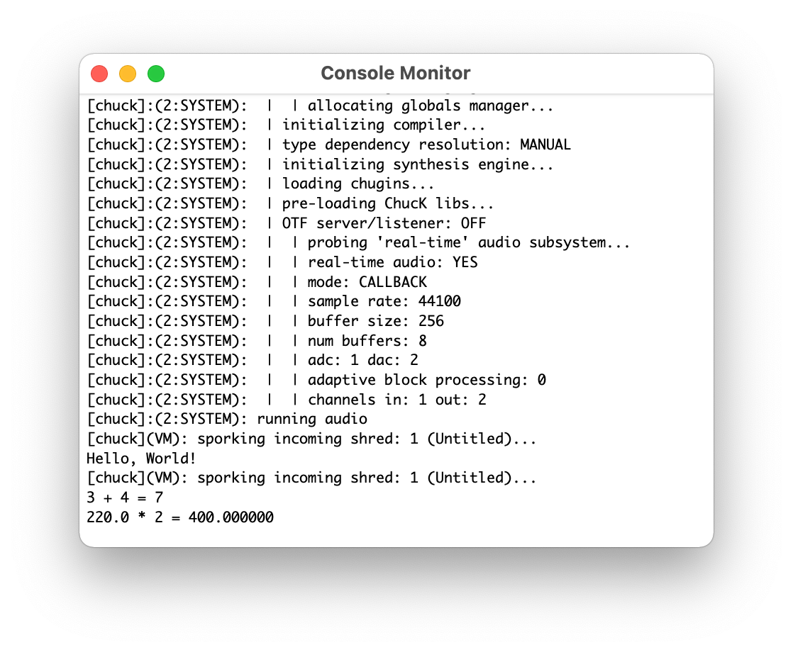
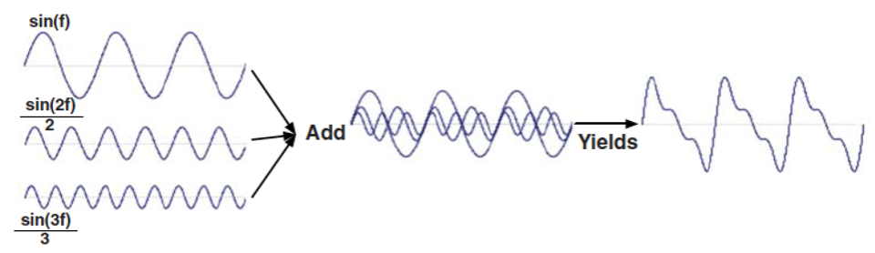

```
(c)도경구 version 0.2 (2021/09/21)
```

### 1. 소개와 준비

### 1-1. ChucK 프로그래밍 언어

ChucK은 실시간으로 소리를 합성하여 음악을 연주하는 프로그램을 작성할 수 있는 범용 프로그래밍 언어이다.

#### 특징

-	시간 개념이 장착된 가상머신(virtual machine)에서 프로그램을 시행하며, 프로그램의 실행 시점을 프로그램 논리로 제어할 수 있어서 지정한 시간에 지정한 기간만큼 소리를 낼 수 있다.
-	독립적으로 실행하는 (즉, 소리를 내는) 쓰레드(thread)를 무제한 만들어 동시에 박자를 맞추어 실행할 수 있다.
-	즉석 프로그래밍(on-the-fly programming)이 가능하다. 즉석 프로그래밍이란 실행중인 프로그램을 정지하거나 재시작할 필요 없이 바로 변경 재실행 가능한 것을 말한다. 따라서 프로그램을 작성하면서 동시에 음악을 연주하는 라이브 코딩(live coding)이 가능하다.
-	다양한 소리를 합성하는 프로그램을 만들 수 있다.
-	외부 입력장치를 연결하여 프로그램을 제어할 수 있다.
-	유무선 네트워크를 통하여 프로그램끼리 데이터를 주고 받을 수 있다.
-	타입 시스템이 엄격한 언어이다. 즉, 변수는 모두 타입을 미리 정해두어야 하고, 타입이 맞지 않는 프로그램은 미리 탐지하여 오류 처리하므로 프로그램 실행 안전성을 높인다.

#### ChucK 프로그램 통합개발환경 설치

-	ChucK 프로그램을 실행하려면, ChucK 프로그래밍 언어 공식 사이트 http://chuck.stanford.edu/ 에서 ChucK을 다운받아 설치해야 한다.

-	설치가 끝나면 miniAudicle 이란 이름의 통합개발환경(IDE, Integrated Development Environment)이 생기는데, miniAudicle은 다음과 3개의 창으로 구성된다.

	-	편집창(Editor)
	-	가상머신창(Virtual Machine)
	-	실행창(Console Monitor)

### 1-2. 첫 ChucK 프로그램 : Hello, World!

아래 절차를 순서대로 따라하며 ChucK 프로그램을 어떻게 실행하는지 스스로 경험해보자.

1.	ChucK을 다운 받아 컴퓨터에 설치하고 miniAudicle을 열면, 다음과 같은 편집창(`Untitled`)과 가상머신창(`Vertial Machine`)이 나타난다.


2.	가상머신창에서 `Start Virtual Machine` 버튼을 늘러 가상머신을 켜면, 다음 그림과 같이 가상머신이 작동을 시작하며 시간이 흐르기 시작한다. 그림 맨 위의 `running time:` 옆에 흐르는 가상머신 시간의 절대 시각을 10만분의 1초 단위로 볼 수 있다. 그리고 오른쪽 그림과 같은 실행창(`Console Monitor`)이 새로 나타난다.


3.	다음 프로그램을 아래 그림과 같이 편집창에 입력한다.


4.	그리고 편집창의 좌상단에 있는 연록색의 `+` 모양의 버튼을 클릭하여 프로그램을 실행한다. 그러면 실행창에 다음 그림과 같이 Hello, World!를 프린트한다.


#### 실행창에 프린트 하기

`<<<`와 `>>>` 사이에 쉼표(`,`)로 구분하여 둘 이상의 식을 나열하면, 그 식을 계산한 결과를 실행창에 나란히 프린트 한다. 예를 들어 편집창에 다음 그림과 같이 프로그램을 작성하고 실행하면,



실행창에 결과를 다음 그림과 같이 프린트하여 보여준다.  



### 1-3. 소리 내기

하나 이상의 물체가 진동(Oscillation)하면서 공기에 생기는 파형(wave)을 음파(sound wave)라고 한다. 음파는 공기를 통하여 퍼져나가는데, 도중에 벽과 다른 물체의 표면에 닿으면 반사를 하면서 여러 방향으로 퍼져나가다가, 궁극적으로 사람의 귀 또는 마이크(microphone)에 도달하여 소리(sound)로 감지하게 된다.

음파가 가지고 있는 속성은 주파수(frequency)와 진폭(amplitude, gain)이다. 주파수는 소리의 높낮이(pitch)를 나타내고, 진폭은 소리의 크기(loudness, volume)를 나타낸다.


음파의 상하 진폭은 소리의 크기를 결정한다. 음파의 세로축으로 진폭이 클수록 소리가 커지고, 진폭이 작아질수록 소리가 작아진다.

일정한 패턴을 반복하는 음파의 주파수는 1초당 같은 패턴 주기의 반복 횟수를 나타낸다. 음파 패턴 한 주기의 진행 시간을 `t`(초)라고 히면 주파수는 `1/t`(Hz)이다. 주파수의 단위 `Hz`는 Hertz의 약자로 주파수를 발견한 사람의 이름에서 따왔다. 예를 들어 `t`가 0.00454545(초) 이면, 주파수는 1/0.00454545 = 220.0(Hz)이다. 주파수가 클수록 (음파 주기의 폭이 좁을수록) 사람은 높은 소리로, 작을수록 (음파 주기의 폭이 넓을수록) 낮은 소리로 인지한다. 예를 들어 피아노 건반은 왼쪽으로 갈수록 주파수가 작아지면서 소리가 낮아지고, 오른쪽으로 갈수록 주파수가 커지면서 소리가 높아진다.


sin 함수 그래프 모양을 그리는 파형을 사인파(sine wave)라고 하며, 컴퓨터로 합성하는 모든 소리의 기본이 된다.


진폭과 크기가 일정 비율로 다른 몇 개의 사인파을 합성(synthesis)하여 다른 모양의 음파를 만들어낼 수 있다.



합성에 사용하는 사인파의 진폭과 크기의 비율에 따라서 삼각파(triangle wave), 톱니파(sawtooth wave), 사각파(square wave)과 같은 다양한 모양의 음파를 합성해낼 수 있다. 음파의 모양에 따라서 음색이 달라진다. 이 4가지 음파를 만들어 소리를 내주는 진동기(oscillator)는 ChucK에 내장되어 있다. 각각 `SinOsc`, `TriOsc`, `SawOsc`, `SqrOsc`라고 부른다.


ChucK 프로그램에서 소리를 내기 위해서는 일단 진동기를 설치해야 한다. 진동기 설치는 다음과 같이 한다.

```
SinOsc s;
```

사인파를 생성하는 진동기를 설치하고 이름을 `s`로 지었다고 이해하면 된다. 이제 언제든지 필요할 때마다 `s`를 호출하여 사인파를 만들어 내게 할 수 있다. 그런데 `SinOsc` 진동기 `s`가 만들어내는 음파는 디지털 데이터이 때문에, 소리로 듣기 위해서는 디지털 음파 데이터를 아날로그 음파로 변환해주어야 한다. 이 변환 작업을 담당하고 있는 장비가 `dac`(digital-to-analog converter의 약자) 이다. `dac`은 ChucK에 기본으로 영구 장착하고 있기 때문에 언제든 가져다 쓰기만 하면된다. 진동기가 만들어 낸 소리를 아날로그 음파로 변환하는 코드는 다음과 같다.

```
SinOsc s => dac;
```

이 코드를 실행하면, `s`라는 이름의 `SinOsc` 진동기를 설치하고 이를 `dac`에 연결한다. 이제 소리를 낼 준비가 되었다. 소리를 내게 하는 코드는 다음은 형식으로 다음 줄에 이어서 작성한다.

```
second => now;
```

이 코드를 실행하면 설치되어 있는 진동기에서 1초 동안 음파를 발생시킨다.`second`는 1초의 기간을 의미하고, `now`는 지금 시점을 나타내는 미리 정해둔 키워드 이다. 이 두 줄의 코드를 편집창에 작성하고 실행하여 1초 동안 사인파 소리가 나는지 확인하자.

진동기의 주파수와 소리크기의 기본값은 각각 `220.0`과 `1.0`으로 설정되어 있다.`s.freq()`는 진동기 `s`의 주파수를 알려주고, `s.gain()`은 진동기 `s`의 소리크기를 알려준다. 다음 코드를 실행하여 확인해보자.

```
<<< "Pitch =", s.freq(), ", Volume =", s.gain() >>>;
```

진동기의 주파수와 소리크기는 원하는 대로 변경할 수 있다. 주파수를 두 배인 `440.0`으로 바꾸고 싶으면 다음과 같이 쓴다.

```
440.0 => s.freq;
```

소리크기도 같은 요령으로 변경할 수 있다. 소리크기를 반으로 줄이고 싶으면 다음과 같이 쓴다.

```
0.5 => s.gain;
```

이제 다음 코드를 실행하여 소리를 들어보고, 실행창에 보여주는 주파수와 소리크기도 확인해보자.

```
SinOsc s => dac;
<<< "Pitch =", s.freq(), ", Volume =", s.gain() >>>;
second => now;
440.0 => s.freq;
0.5 => s.gain;
<<< "Pitch =", s.freq(), ", Volume =", s.gain() >>>;
second => now;
```

#### 프로그램 실행하기

이 프로그램을 실행하려면 편집창 상단의 아래 그림과 같은 모양의 버튼 3개 중에서 `+` 모양의 버튼을 클릭한다.

바로 Virtual Machine 창에서 프로그램이 실행을 시작되었음을 볼 수 있다. 프로그램의 실행이 진행되는 시간이 오른쪽에 표시된다.

### 실습 문제

#### 1-1. 나의 첫 ChucK 프로그램

1.	`SinOsc` 발진기(oscillator)로 아래 나열한 주파수(frequency, pitch)와 소리크기(loudness, gain, volume)를 바꾸어 가며 소리의 차이를 들어보자.
	-	주파수: 220, 330, 440, 660Hz
	-	소리크기: 0.25, 0.5, 0.75, 1.0
2.	이번엔 발진기를 `TriOsc`, `SqrOsc`, `SawOsc`로 각각 바꾸어 소리의 차이를 들어보자.

#### 1-2. ChucK 프로그램 실행 테스트

-	`sample.zip` 파일을 다운받아 압축을 푼 다음, 하나씩 실행하여 소리를 들으며, Virtual Machine 창과 Console Monitor 창이 어떻게 반응하고 변화하는지 관찰해보자.
