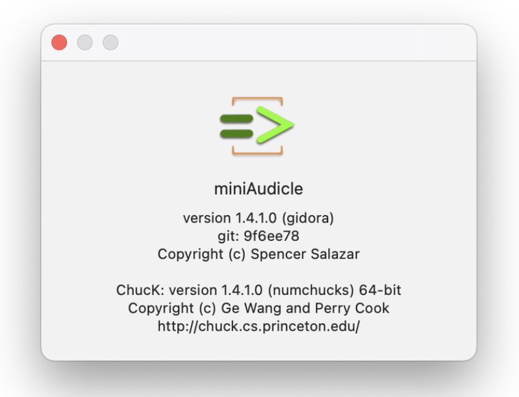
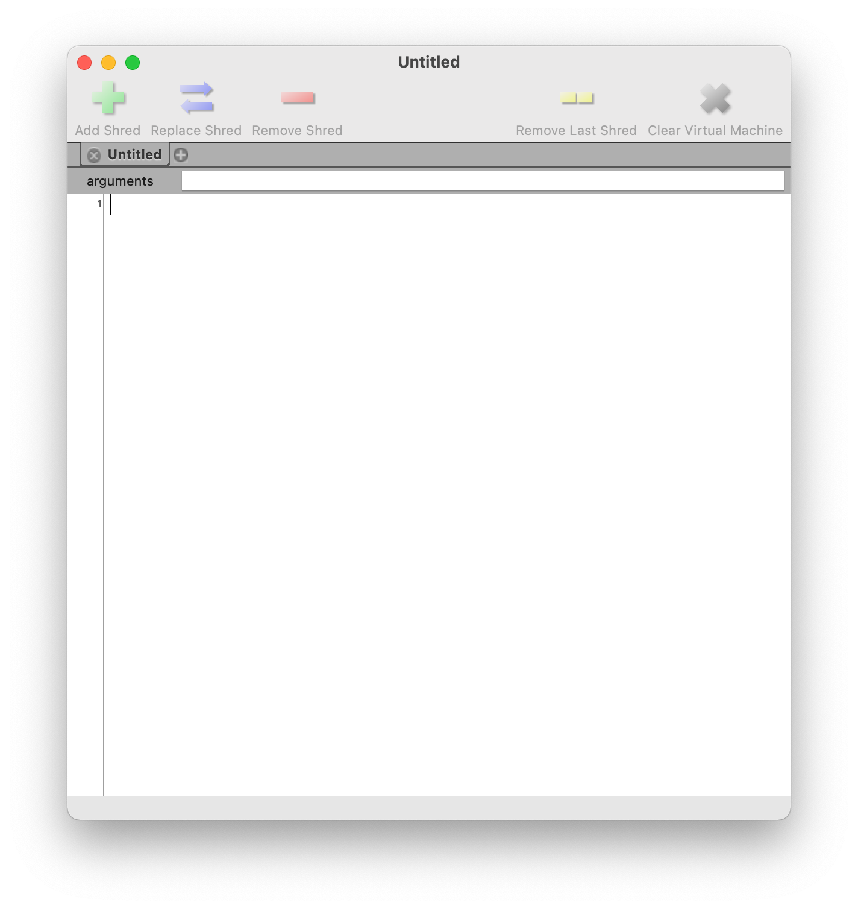
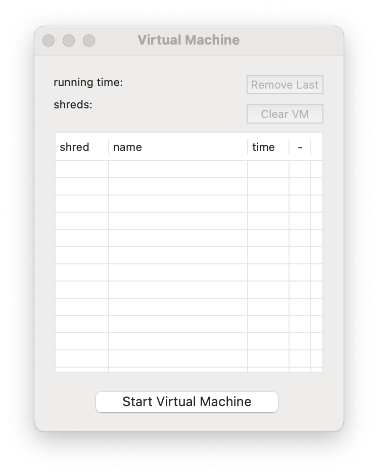
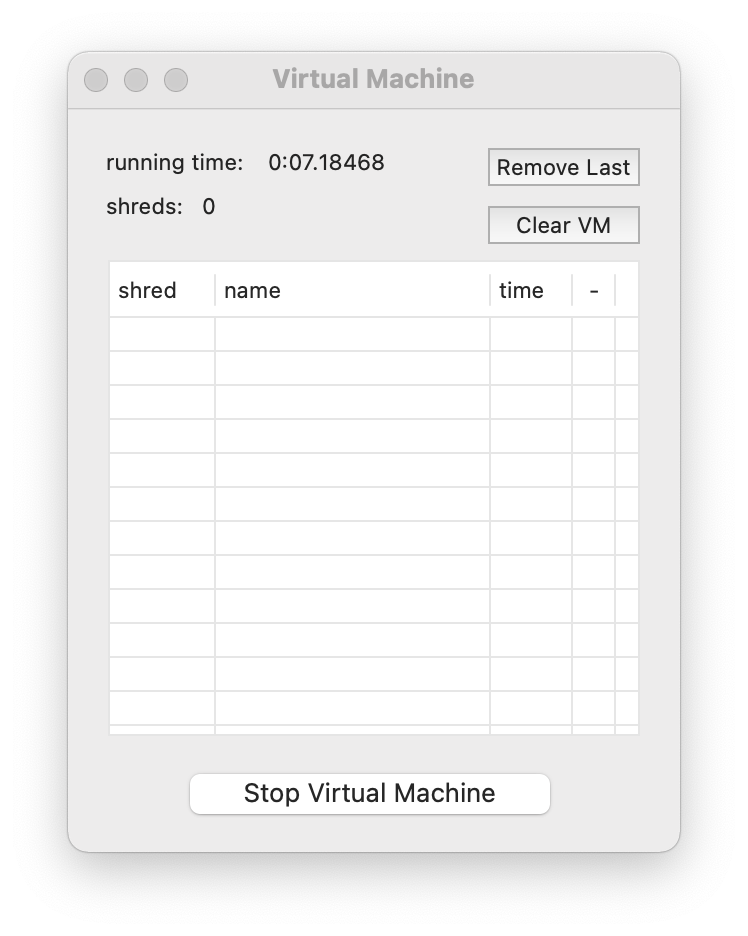
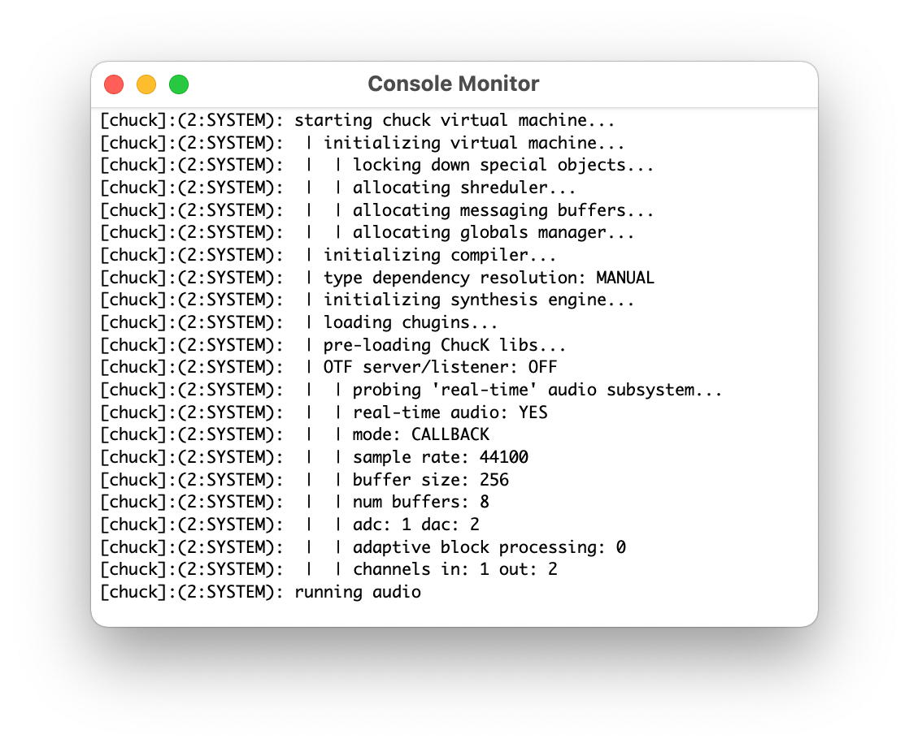
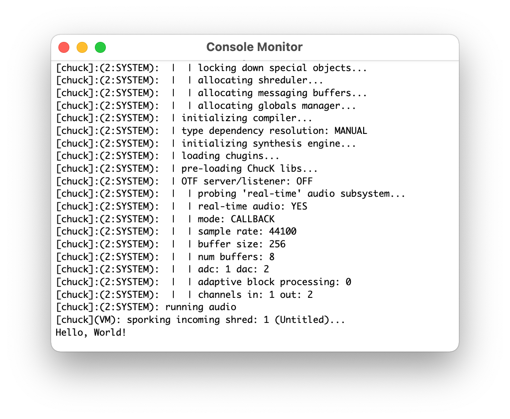
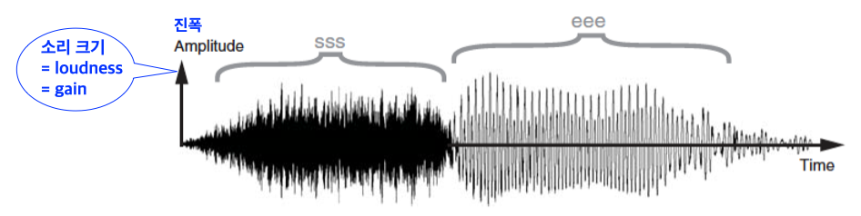
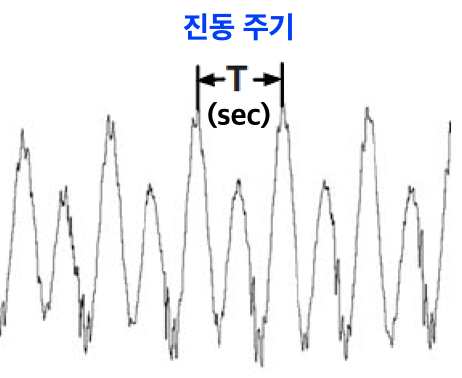
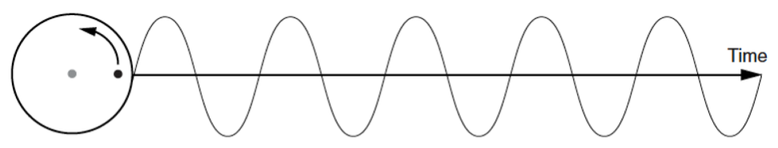
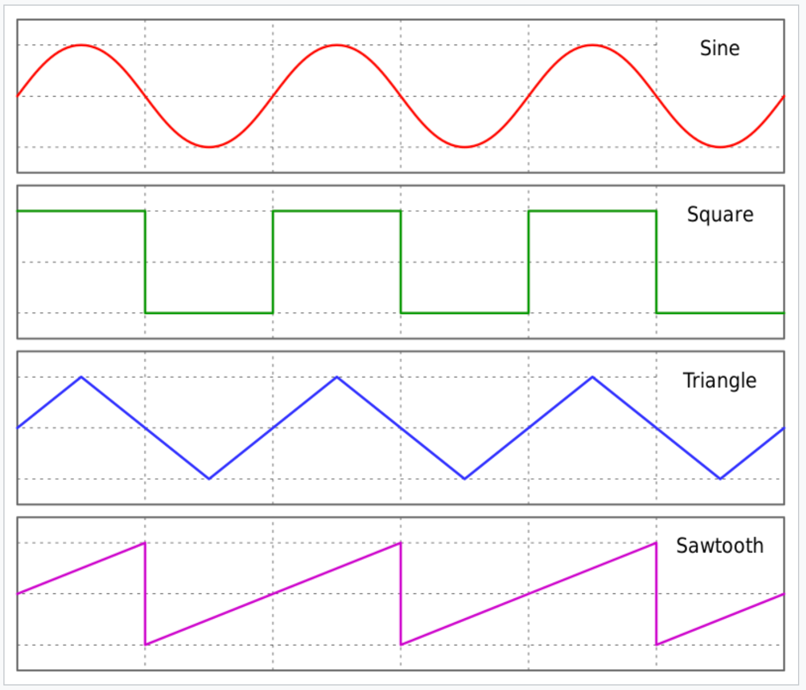

```
(c)도경구 version 1.0 (2022/08/30)
```

### 1. 소개와 준비

### 1-1. ChucK 프로그래밍 언어


ChucK은 실시간으로 소리를 합성하고 음악을 연주하는 프로그램을 작성할 수 있는 범용 프로그래밍 언어이다.

#### 특징

-	프로그램을 실행하는 가상머신(virtual machine)에 자체적으로 작동하는 시계가 장착되어 있어서, 특정 시점부터 지정한 시간동안 소리를 내도록 프로그램 논리로 제어할 수 있다.
-	독립적으로 실행하는 (즉, 소리를 내는) 쓰레드(thread)를 무제한 만들어 박자를 맞추어 한꺼번에 실행할 수 있는 동시 프로그래밍(concurrent programming)이 가능하다.
-	즉석 프로그래밍(on-the-fly programming)이 가능하다. 즉석 프로그래밍이란 실행중인 프로그램을 실시간 변경하여 바로 재실행 가능한 것을 말한다. 따라서 프로그램을 작성하면서 동시에 음악을 연주하는 라이브 코딩(live coding)이 가능하다.
-	다양한 소리를 합성하는 프로그램을 만들 수 있다.
-	외부 입력장치를 연결하여 프로그램을 제어할 수 있어서 컴퓨터를 악기로 사용할 수 있다.
-	유무선 네트워크를 통하여 프로그램끼리 원격으로 데이터를 주고 받으면서 합주를 할 수 있다.
-	변수의 타입을 엄격하게 정하는 언어이다. 즉, 변수 타입은 미리 정해두고, 타입이 맞지 않는 프로그램은 실행 전 미리 탐지하여 오류 처리하므로 프로그램 실행 안전성을 높인다.
-   객체지향 패러다임으로 프로그램 구성이 가능하다.
-   오픈소스이며 무료이다.

#### ChucK 프로그램 통합개발환경 설치

-	ChucK 프로그래밍 언어 공식 사이트 [http://chuck.stanford.edu/](http://chuck.stanford.edu/)에서 ChucK을 다운받아 설치한다.

-	설치가 끝나면 `miniAudicle` 이란 이름의 통합개발환경(IDE, Integrated Development Environment)이 생긴다.



-	`miniAudicle`을 열면, 다음과 같은 편집창(`Untitled`)과 가상머신창(`Virtual Machine`)이 나타난다.



- 편집창에서는 프로그램을 작성하고, 수정하고, 저장하고, 실행하는 작업을 할 수 있다.
- 가상머신창은 프로그램의 실행 상황을 보여주는 역할을 한다. 
	- 가상머신을 켜고 끄는 버튼이 하단에 위치하고 있는데, `Start Virtual Machine` 버튼을 늘러 가상머신을 켜야 프로그램을 실행할 수 있다. 이 버튼은 눌러서 가상머신을 켜면, 가상머신을 끌 수 있는 `Stop Virtual Machine`으로 버튼이 바뀐다.
    - 가상머신이 작동을 시작하면, 아래 왼쪽 그림과 같이 절대 시간이 흐르기 시작한다. 가상머신창 상단의 `running time:`에서 가상머신의 절대 시각을 10만분의 1초 단위로 볼 수 있다. 
    - 계산을 수행하는 독립 주체를 쓰레드(thread)라고 하는데, ChucK 프로그램에서는 쉬레드(shred)라는 별칭을 사용한다. 여러 쉬레드가 동시에 실행이 가능한데, 가상머신창의 상단 둘째 줄의 `shreds:`에는 실행 중인 쉬레드의 개수가 표시된다.
    - 쉬레드는 실행 시작 순서대로 일련번호가 매겨지고, 실행한 프로그램의 파일 이름과, 진행 시간이 아래 테이블에 실시간으로 표시된다. 
    - 상단 우측에 있는 두개의 버튼은 쉬레드를 지우는 역할을 한다. `Remove Last`는 가장 최근에 생긴 쉬레드 하나를 지우고, `Clear VM`은 실행 중인 쉬레드를 모두 지우면서 가상머신의 실행 환경을 초기 상태로 되돌린다.
- 아래 오른쪽 그림과 같은 콘솔모니터(`Console Monitor`)는 가상머신을 켬과 동시에 새로 나타난다. 콘솔모니터는 표준출력창의 역할을 한다.




### 1-2. 첫 ChucK 프로그램 : Hello, World!

이제 프로그램을 실행할 준비가 끝났으니 `Hello, World!`를 콘솔모니터에 보여주는 프로그램을 작성하여 실행해보자.

- 편집창에 아래 그림과 같이 `<<<`와 `>>>` 사이에 문자열을 넣고 `;`를 이어붙인 프로그램을 입력한다.


- 가상머신을 켜고 편집창의 좌상단에 있는 연록색의 `+` 모양의 버튼을 클릭하면 프로그램이 실행된다. 그러면 실행창에 다음 그림과 같이 `Hello, World!` 식을 계산한 결과를 타입과 함께 보여준다.




### 1-3. 소리내는 프로그램 : Hello, Sine Wave!

#### 소리의 특성

물체가 진동(Oscillation)하여 생기는 소리(sound)는 공기에 파형(wave)을 만들어 내는데, 이를 **음파(sound wave)**라고 한다. 음파는 공기를 통하여 사방으로 퍼져나가는데, 도중에 벽과 다른 물체의 표면에 닿으면 반사를 하면서 여러 방향으로 퍼져나가다가, 궁극적으로 사람의 귀 또는 마이크(microphone)에 도달하여 소리로 감지하게 된다.



음파가 가지고 있는 속성은 **진폭(amplitude, gain)**과 **주파수(frequency)** 이다.

<U>음파의 상하 진폭은 소리의 크기(loudness, volume)를 결정한다</U>. 세로축으로 음파의 진폭이 클수록 소리가 커지고, 진폭이 작아질수록 소리가 작아진다.

<U>주파수는 소리의 높낮이(고음/저음,pitch)를 나타낸다</U>. 음파의 주파수는 1초 동안 같은 패턴을 반복하는 주기의 횟수이다. 음파 패턴 한 주기의 진행 시간을 `T`(초)라고 하면 주파수는 `1/T`(Hz)이다. 주파수의 단위 `Hz`는 Hertz의 약자로 주파수를 발견한 사람의 이름에서 따왔다. 예를 들어 `T`가 0.00454545(초) 이면, 주파수는 1/0.00454545 = 220.0(Hz)이다. 주파수가 클수록 (음파 주기의 폭이 좁을수록) 사람은 고음(높은소리)으로, 작을수록 (음파 주기의 폭이 넓을수록) 저음(낮은소리)으로 인지한다. 예를 들어 피아노 건반은 왼쪽으로 갈수록 주파수가 작아지면서 소리가 낮아지고, 오른쪽으로 갈수록 주파수가 커지면서 소리가 높아진다.



다음 그림과 같이 sin 함수 그래프 모양을 그리는 파형을 <U>사인파(sine wave)</U>라고 하며, 컴퓨터로 합성하는 모든 소리의 기본이 된다.



진폭과 크기가 일정 비율로 다른 몇 개의 사인파을 합성(synthesis)하여 다른 모양의 음파를 만들어낼 수 있다. 합성에 사용하는 사인파의 진폭과 크기의 비율에 따라서 <U>삼각파(triangle wave)</U>, <U>톱니파(sawtooth wave)</U>, <U>사각파(square wave)</U>과 같은 다양한 모양의 음파를 합성해낼 수 있다. 음파의 모양에 따라서 음색이 달라진다. 이 4가지 음파를 만들어 소리를 내주는 **진동기(oscillator)**는 ChucK에 내장되어 있다. 각각 `SinOsc`, `TriOsc`, `SawOsc`, `SqrOsc`라고 부른다. 이 중에서 `SqrOsc`는 목관악기인 클라리넷과 비슷한 소리가 나고, `SawOsc`는 바이올린과 비슷한 소리가 난다.



#### 소리 내기

ChucK 프로그램에서 소리를 내기 위해서는 일단 진동기를 설치해야 한다. 진동기 설치는 다음과 같이 한다.

```
SinOsc s;
```

사인파를 생성하는 진동기를 설치하고 이름을 `s`로 지었다고 이해하면 된다. 이제 언제든지 필요할 때마다 `s`를 호출하여 사인파를 만들어 내게 할 수 있다. 그런데 `SinOsc` 진동기 `s`가 만들어내는 음파는 디지털 데이터이 때문에, 컴퓨터 스피커로 소리를 듣기 위해서는 디지털 음파 데이터를 아날로그 음파로 변환해주어야 한다. 이 변환 작업을 담당하고 있는 장비가 `dac`(digital-to-analog converter의 약자) 이다. `dac`은 ChucK에 기본으로 영구 장착하고 있기 때문에 언제든 가져다 쓰기만 하면된다. 진동기와 `dac`을 연결하는 코드는 다음과 같다.

```
SinOsc s => dac;
```

이 코드를 실행하면, `s`라는 이름의 `SinOsc` 진동기를 설치하고 이를 `dac`에 연결한다. 이제 소리를 낼 준비가 되었다. 소리를 내게 하는 코드는 다음은 형식으로 다음 줄에 이어서 작성한다.

```
second => now;
```

이 코드를 실행하면 설치되어 있는 진동기에서 1초 동안 음파를 발생시킨다. `second`는 1초의 기간을 의미하고, `now`는 지금 시점을 나타내는 미리 정해둔 키워드 이다. 이 두 줄의 코드를 편집창에 작성하고 실행하여 1초 동안 사인파 소리가 나는지 확인하자.

진동기의 주파수의 범위는 0-20,000 Hz 이고, 기본값은 `220.0`으로 설정되어 있다. 소리크기의 범위는 0.0-1.0 이고, 기본값은 `1.0`으로 설정되어 있다. `s.freq()`로 진동기 `s`의 주파수를, `s.gain()`으로 진동기 `s`의 소리크기를 알아낼 수 있다. 다음 코드를 실행하여 기본 설정 값을 확인해보자.

```
<<< "Pitch =", s.freq(), ", Volume =", s.gain() >>>;
```

진동기의 주파수와 소리크기는 원하는 대로 변경할 수 있다. 주파수를 두 배인 `440.0`으로 바꾸고 싶으면 다음과 같이 쓴다.

```
440.0 => s.freq;
```

소리크기도 같은 요령으로 변경할 수 있다. 소리크기를 반으로 줄이고 싶으면 다음과 같이 쓴다.

```
0.5 => s.gain;
```

이제 다음 코드를 실행하여 소리를 들어보고, 실행창에 보여주는 주파수와 소리크기도 확인해보자.

```
SinOsc s => dac;
<<< "Pitch =", s.freq(), ", Volume =", s.gain() >>>;
second => now;
440.0 => s.freq;
0.5 => s.gain;
<<< "Pitch =", s.freq(), ", Volume =", s.gain() >>>;
second => now;
```

#### 실행창에 프린트 하기

`<<<`와 `>>>` 사이에 쉼표(`,`)로 구분하여 둘 이상의 식을 나열하면, 그 식을 계산한 결과를 실행창에 나란히 프린트 한다. 쉼표가 오는 부분은 빈칸을 하나 삽입한다. 


#### 프로그램 실행하기

이 프로그램을 실행하려면 편집창 상단의 아래 그림과 같은 모양의 버튼 3개 중에서 `+` 모양의 버튼을 클릭한다.

바로 Virtual Machine 창에서 프로그램이 실행을 시작되었음을 볼 수 있다. 프로그램의 실행이 진행되는 시간이 오른쪽에 표시된다.

### 실습 문제

#### 1-1. 나의 첫 ChucK 프로그램

`SinOsc` 발진기(oscillator)로 아래 나열한 주파수(frequency, pitch)와 소리크기(loudness, gain, volume)를 바꾸어 가며 소리의 차이를 들어보자. 

	-	주파수: 220, 330, 440, 660Hz
	-	소리크기: 0.25, 0.5, 0.75, 1.0
    
1. 주파수를 440으로 고정시키고 소리크기별로 1초씩 소리가 나도록 프로그램을 작성하여 실행해보자.
2. 소리크기를 0.75로 고정시키고 주파수별로 1초씩 소리가 나도록 프로그램을 작성하여 실행해보자.
3. 발진기를 `TriOsc`, `SqrOsc`, `SawOsc`로 각각 바꾸어 소리의 차이를 들어보자.

#### 1-2. ChucK 프로그램 실행 테스트

-	`sample.zip` 파일을 다운받아 압축을 푼 다음, 하나씩 실행하여 소리를 들으며, Virtual Machine 창과 Console Monitor 창이 어떻게 반응하고 변화하는지 관찰해보자.
