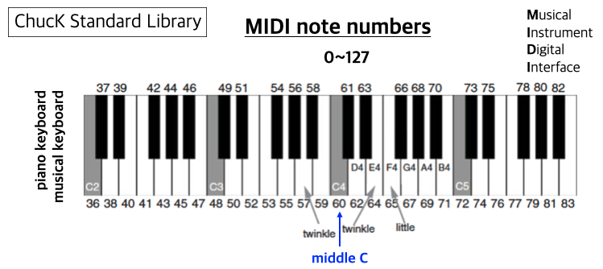

```
(c)도경구 version 0.31 (2021/10/18)
```
- 2021/10/18 수정 : 포맷이 깨진 부분 수정, 표현이 어색한 부분 수정 - 심각한 수정 없음


## 2. 음악 프로그래밍 기본

### 2-1. 변수와 타입

다음은 기본 주파수로 1초 소리내고, 이어서 주파수를 440으로 변경하고 1초 소리내고, 이어서 원 주파수로 돌아가서 1초 소리내는 프로그램이다. 프로그램을 읽고 이해한 뒤, 실행하여 소리를 들어보자.

```
SinOsc s => dac;
<<< "Pitch =", s.freq(), ", Volume =", s.gain() >>>;
second => now;
440 => s.freq;
0.5 => s.gain;
<<< "Pitch =", s.freq(), ", Volume =", s.gain() >>>;
second => now;
220 => s.freq;
1.0 => s.gain;
<<< "Pitch =", s.freq(), ", Volume =", s.gain() >>>;
second => now;
```

#### 주석 달기

프로그램을 이해하는데 도움이 되는 설명이나 기록해 둘 가치가 있는 프로그램 고유 정보를 프로그램의 실행에는 영향을 미치지 않게 프로그램 텍스트에 별도로 추가할 수 있다. 이를 주석(comments)이라고 하는데, 주석을 다는 방법은 두 가지가 있다. 

- 한줄 주석 : `//` 부터 같은 줄의 끝까지 이며, 프로그램으로 여기지 않는다. 
- 여러줄 주석 : `/*` 로 시작하여 `*/` 로 끝난다. 이 사이에 있는 문자는 몇 줄이든 상관없이 모두 프로그램으로 여기지 않는다.

위 프로그램에 다음과 같이 음별로 한줄 주석을 총 세줄 달았다. 프로그램의 가독성이 조금 좋아졌다. 그럼에도 프로그램의 실행에는 전혀 영향을 미치지 않는다.

```
SinOsc s => dac;
// Sound 1: the original pitch
<<< "Pitch =", s.freq(), ", Volume =", s.gain() >>>;
second => now;
// Sound 2: double the pitch
440.0 => s.freq;
0.5 => s.gain;
<<< "Pitch =", s.freq(), ", Volume =", s.gain() >>>;
second => now;
// Sound 3: return to the original
220.0 => s.freq;
1.0 => s.gain;
<<< "Pitch =", s.freq(), ", Volume =", s.gain() >>>;
second => now;
```

#### 무한 시간 진행 (무한 루프)

둘째와 셋째 음을 무한 반복하여 내게 하려면 그 부분을 다음과 같이 `while (true) { ... }`로 감싸면 된다. 이 프로그램을 실행하여 어떤 소리가 나는지 확인해보자.

```
SinOsc s => dac;
// Sound 1: the original pitch
<<< "Pitch =", s.freq(), ", Volume =", s.gain() >>>;
second => now;
while (true) {
    // Sound 2: double the pitch
    440.0 => s.freq;
    0.5 => s.gain;
    <<< "Pitch =", s.freq(), ", Volume =", s.gain() >>>;
    second => now;
    // Sound 3: return to the original
    220.0 => s.freq;
    1.0 => s.gain;
    <<< "Pitch =", s.freq(), ", Volume =", s.gain() >>>;
    second => now;
}
```

이 프로그램은 둘째와 셋째 음을 무한 반복한다. 프로그램 실행을 강제로 멈추려면 편집창 상단의 `-` 버튼을 클릭하면 된다.

#### 프로그램 실행 제어 버튼 활용 방법


-	왼쪽에 위치한 `+` 모양의 버튼을 여러번 클릭해보자. `+` 버튼을 한 번 클릭할 때마다 Virtual Machine 창에 새로운 Shred가 하나씩 추가된다. 가상머신에서 하나의 독립적인 실행 단위를 Shred라고 하며, 각 Shred 별로 실행 경과 시간이 오른쪽에 표시된다.

-	오른쪽에 위치한 `-` 버튼은 가장 최근에 생긴 Shred를 하나 제거한다.

-	중간에 위치한 양방향 화살표 버튼을 누르면, 가장 최근에 생긴 Shred를 처음부터 새로 시작한다.

-	여러 개의 Shred를 동시에 실행할 수 있으므로, Shred 별로 고유한 소리를 박자에 맞추어 함께 낼 수 있다.

#### 변수

값을 기억해두고 재사용하려면 변수를 사용한다. 변수는 사용하기 전에 다음과 같은 형식으로 선언해야 한다. 

- 변수 선언(declaration) 
    - 문법: `<타입> <변수>` 
    - 예: `int pitch;`, `float volume;`

선언한 변수에 계산 값을 기억하려면 계산할 식을 다음과 같은 형식으로 지정한다. 

- 지정(assignment) 
    - 문법: `<식> => <변수>` 
    - 예: `220 => pitch;`, `0.6 => volume;`

다음과 같이 한줄에 선언과 지정을 나란히 둘 수도 있다. 

- 선언과 배정의 합체 가능 
    - 문법: `<식> => <타입> <변수>` 
    - 예: `220 => int pitch;`, `0.6 => float volume;`

#### 기본 타입

수는 정수와 실수를 다음과 같이 별개 타입으로 구별한다. 

- 타입의 종류: `int`(정수), `float`(실수) 
- 연산자: `+`, `-`, `*`, `/` 
- 식: 이항(피연산자가 둘), 중위(연산자가 가운데 위치), 우선순위, 결합법칙 

실수 타입의 변수에는 정수 값을 지정할 수 있지만, 정수 타입의 변수에는 실수 값 지정을 허용하지 않는다.

#### 시간 단위

시간을 표현하는 단위는 다음과 같이 표현한다.

| 키워드   | 지속 기간                  |
|:--------:|:--------------------------:|
|  `samp`  | 1 디지털샘플 = 1/44100(초) |
|   `ms`   |         1/1000(초)         |
| `second` |           1(초)            |
| `minute` |           1(분)            |
|  `hour`  |          1(시간)           |
|  `day`   |           1(일)            |
|  `week`  |           1(주)            |

#### ChucK 데이터 타입

ChucK 프로그램에서 다룰 수 있는 값의 타입은 표로 정리하면 다음과 같다.

| 데이터 타입 | 설명              | 예                                       |
|:-----------:|:-----------------:|:----------------------------------------:|
|    `int`    |   정수            | ..., `-2`, `-1`, `0`, `1`, `2`, `3`, ... |
|   `float`   | 실수              |        `0.5`, `220.0`, `3.141592`        |
|  `string`   |      문자열       |         `"Hello"`, `"sound.wav"`         |
|    `dur`    |       기간        |         `1::second`, `3*minute`          |
|   `time`    |    ChucK 시간     |                `34580.0`                 |
|   `void`    |       없음        |                                          |

`time` 타입은 시간 값을 나타내며 정수 또는 실수로 표현할 수 있다. `dur` 타입은 시간이 흐르는 기간(duration)을 나타내며 아래 사례와 같이 `::`를 시간 값과 시간 단위 사이에 두어 표현한다. 시간 값을 생략하고 단위만 쓰면, 단위 앞에 `1::`을 붙인 것과 같다. `dur` 타입의 값을 계산하는 수식에도 `int`와 `float` 타입의 수식에 쓰는 연산자인 `+`, `-`, `*`, `/`, `%`를 모두 사용할 수 있다.

```
0.8::second => dur quarter; // 한 박자, 4분음표
4::quarter => dur whole;    // 네 박자, 온음표
4 * quarter => dur whole;   // 네 박자, 온음표
whole / 2 => dur half;      // 두 박자, 2분음표
quarter / 2 => dur eighth;  // 반 박자, 8분음표
```

#### 키워드 `now`

-	ChucK 가상머신의 시계(clock)에서 현재를 나타내는 특수 키워드
-	`now`는 실행하는 시점의 시각을 항상 알고 있음
-	`now`는 프로그램으로 수정 불가
-	활용 사례

```
3::second => now;
```

이 코드의 실행 의미는 "지금부터 3초동안 가용한 모든 진동기의 소리를 내라." 이다.

#### 변수 선언 및 사용 사례

위에서 공부한 프로그램을 다음과 같이 변수를 활용하여 다시 작성하였다. 

```
SinOsc s => dac;
220 => int pitch => s.freq;
0.6 => float volume => s.gain;
0.5::second => dur beat;
// Sound 1: the original pitch
<<< "Pitch =", s.freq(), ", Volume =", s.gain() >>>;
beat => now;
while (true) {
    // Sound 2: double the pitch
    pitch * 2 => s.freq;
    volume / 2 => s.gain;
    <<< "Pitch =", s.freq(), ", Volume =", s.gain() >>>;
    beat => now;
    // Sound 3: return to the original
    pitch => s.freq;
    volume => s.gain;
    <<< "Pitch =", s.freq(), ", Volume =", s.gain() >>>;
    beat => now;
}
```

시작 주파수와 소리크기를 각각 변수 `pitch`와 `volume`으로 선언하고 초기값을 지정하였다. 둘째, 셋째 소리의 주파수와 소리크기는 각각 그 변수 값을 기준으로 식을 세워 지정하였다. 이렇게 하면 추후에 시작 주파수와 소리크기의 변경이 필요한 경우, 각 변수의 초기값만 변경하면 되므로 수정이 용이해진다. 소리를 내는 시간도 `beat` 변수를 선언하여 기준을 정했다. 소리나는 시간을 변경하고 싶으면 이 변수의 초기값만 변경하면 되어 수정이 마찬가지로 용이해진다. 변수를 사용하면 왜 좋은지 보여주는 사례이다.


이제 이 프로그램이 내는 소리에 조금씩 변화를 주어보자.

#### 소리 사이에 공백 넣기

위 프로그램은 소리와 소리 사이에 공백이 없어서 이어서 들린다. 하지만 주파수가 변하기 때문에 이어서 들리는 소리를 어떻게든 구별이 가능하지만, 주파수와 소리크기가 같은 음을 이어서 내는 경우 소리 사이에 공백이 없으면 두 음의 구별이 불가능해 진다. 그런데 각 소리의 뒤 부분에 약간의 간격을 두어 그동안 소리를 전혀 나지 않게 하면 소리 별로 확실히 구별하여 들을 수 있다. 이를 위해서 소리의 뒷 부분 1/5 기간동안 소리 나지 않게 다음과 같이 프로그램을 수정하였다. 프로그램을 이해하고 실행하여 소리가 어떻게 들리는지 확인해보자.

```
SinOsc s => dac;
220 => int pitch => s.freq;
0.6 => float volume => s.gain;
0.0 => float off;
0.5::second => dur beat;
// Sound 1: the original pitch
<<< "Pitch =", s.freq(), ", Volume =", s.gain() >>>;
beat * 4 / 5  => now;
off => s.gain;
beat / 5 => now;
while (true) {
    // Sound 2: double the pitch
    pitch * 2 => s.freq;
    volume / 2 => s.gain;
    <<< "Pitch =", s.freq(), ", Volume =", s.gain() >>>;
    beat * 4 / 5 => now;
    off => s.gain;
    beat / 5 => now;
    // Sound 3: return to the original
    pitch => s.freq;
    volume => s.gain;
    <<< "Pitch =", s.freq(), ", Volume =", s.gain() >>>;
    beat * 4 / 5 => now;
    off => s.gain;
    beat / 5 => now;
}
```

#### 주파수 2배씩 증가시키기

이번에는 반복할 때마다 주파수는 2배롤 늘리도록 프로그램을 다음과 같이 수정하였다. 프로그램의 어떤 부분을 수정했는지 찾아서 이해하고, 실행하여 소리가 어떻게 다르게 들리는지 확인해보자.

```
SinOsc s => dac;
220 => int pitch => s.freq;
0.6 => float volume => s.gain;
0.0 => float off;
0.5::second => dur beat;
// Sound 1: the original pitch
<<< "Pitch =", s.freq(), ", Volume =", s.gain() >>>;
beat * 4 / 5  => now;
off => s.gain;
beat / 5 => now;
while (true) {
    // Sound 2: double the pitch
    pitch * 2 => s.freq;
    volume / 2 => s.gain;
    <<< "Pitch =", s.freq(), ", Volume =", s.gain() >>>;
    beat * 4 / 5 => now;
    off => s.gain;
    beat / 5 => now;
    // Sound 3: return to the original
    pitch => s.freq;
    volume => s.gain;
    <<< "Pitch =", s.freq(), ", Volume =", s.gain() >>>;
    beat * 4 / 5 => now;
    off => s.gain;
    beat / 5 => now;
    2 *=> pitch;
}
```

-	`2 *=> pitch`는 `pitch * 2 => pitch`를 줄여서 표현한 것으로 실행의미는 동일하다.

#### 소리크기 조금씩 증가시키기

이번에는 주파수를 2배로 늘리는 대신, 소리크기를 0.0에서 시작하여 반복할 때마다 0.1씩 증가하도록 프로그램을 다음과 같이 수정하였다. 이번에도 프로그램의 어떤 부분을 수정했는지 찾아서 이해하고, 실행하여 소리가 어떻게 다르게 들리는지 확인해보자.

```
SinOsc s => dac;
220 => int pitch => s.freq;
0.0 => float volume => s.gain;
0.0 => float off;
0.5::second => dur beat;
// Sound 1: the original pitch
<<< "Pitch =", s.freq(), ", Volume =", s.gain() >>>;
beat * 4 / 5  => now;
off => s.gain;
beat / 5 => now;
while (true) {
    0.1 +=> volume;
    // Sound 2: double the pitch
    pitch * 2 => s.freq;
    volume / 2 => s.gain;
    <<< "Pitch =", s.freq(), ", Volume =", s.gain() >>>;
    beat * 4 / 5 => now;
    off => s.gain;
    beat / 5 => now;
    // Sound 3: return to the original
    pitch => s.freq;
    volume => s.gain;
    <<< "Pitch =", s.freq(), ", Volume =", s.gain() >>>;
    beat * 4 / 5 => now;
    off => s.gain;
    beat / 5 => now;
}
```

### 2-2. 제어 구조

#### 무작위수 자동 생성(Random Number Generation)

ChucK `Math` 라이브러리의 무작위수 생성 메소드를 활용하여 무작위수를 얻을 수 있다. 수의 타입별로, 범위의 지정 여부별로 다음과 같이 다르게 호출하여 활용할 수 있다.

| 메소드                                | 결과 타입 | 설명                                                       |
|:-------------------------------------:|:---------:|:----------------------------------------------------------:|
|            `Math.random()`            |   `int`   | `0`과 `Math.RANDOM_MAX` 범위에서 정수 하나를 무작위로 생성 |
|   `Math.random2(int min, int max)`    |   `int`   |      `[min, max]` 범위에서 정수 하나를 무작위로 생성       |
|           `Math.randomf()`            |  `float`  |        `[0, 1]` 범위에서 실수 하나를 무작위로 생성         |
| `Math.random2f(float min, float max)` |  `float`  |      `[min, max]` 범위에서 실수 하나를 무작위로 생성       |

##### 예: 주사위 던지기

```
while (true) {
    <<< Math.random2(1,6) >>>;
    0.5::second => now;
}
```

##### 예: 무작위로 소리 내기

```
TriOsc t => dac;
0.1 => t.gain;
while (true) {
    Math.random2(30,1000) => t.freq;
    Math.random2f(30,1000)::ms => now;
}
```

이 프로그램을 실행하면 0.03\~1초 범위 내에서 무작위로 선택된 기간동안 30\~1000 범위 내에서 무작위로 선택된 주파수의 `TriOsc` 소리가 난다. 이 소리는 무한 반복된다.

#### 선택문 `if`

조건이 맞는 경우에만 특정 코드블록을 실행하도록 할 수 있다. 이를 선택문이라고 하며 다음과 같은 형식으로 작성한다. 

- 선택문 
    - 문법: `if <조건식> <코드블록>` 
    - 실행의미: `<조건식>`의 실행 결과가 `0`이 아니면 `<코드블록>`을 실행하고, `0`이면 아무 것도 하지 않는다.

ChucK에 `true`와 `false`가 있어서 논리값을 프로그램에 표현 가능하지만, 실제로 갖고 있는 값은 각각 `1`과 `0` 이다. 따라서 논리값이 따로 없다. 다음 코드를 실행하여 확인해보자.

```
<<< true >>>;
<<< false >>>;
```

잎에서 공부한 프로그램을 추가로 변형해보자. 이번에는 반복하면서 1/2의 확률로 두 음 사이에 가운데 주파수 음을 내도록 하였다. 프로그램에서 추가된 부분을 찾아서 이해하고, 직접 실행하여 소리를 들어보자.

```
SinOsc s => dac;
220 => int pitch => s.freq;
0.6 => float volume => s.gain;
0.0 => float off;
0.5::second => dur beat;
// Sound 1: the original pitch
<<< "Pitch =", s.freq(), ", Volume =", s.gain() >>>;
beat * 4 / 5  => now;
off => s.gain;
beat / 5 => now;
while (true) {
    // Sound 2: double the pitch
    pitch * 2 => s.freq;
    volume / 2 => s.gain;
    <<< "Pitch =", s.freq(), ", Volume =", s.gain() >>>;
    beat * 4 / 5 => now;
    off => s.gain;
    beat / 5 => now;
    // Sound 2+: 1.5 times the pitch randomly
    if (Math.random2(0,1)) {
        pitch * 1.5 => s.freq;
        volume / 1.5 => s.gain;
        <<< "Pitch =", s.freq(), ", Volume =", s.gain() >>>;
        beat * 4 / 5 => now;
        off => s.gain;
        beat / 5 => now;
    }
    // Sound 3: return to the original
    pitch => s.freq;
    volume => s.gain;
    <<< "Pitch =", s.freq(), ", Volume =", s.gain() >>>;
    beat * 4 / 5 => now;
    off => s.gain;
    beat / 5 => now;
}
```

#### 선택문 `if` ... `else`

조건이 맞는 경우에 특정 코드블록을 실행하고, 맞지 않는 경우에는 다른 코드를 실행하도록 하려면, 다음과 같은 형식으로 작성한다. 

- 선택문 
    - 문법: `if <조건식> <코드블록1> else <코드블록2>` 
    - 실행의미: `<조건식>`의 실행 결과가 `0`이 아니면 `<코드블록1>`을 실행하고, `0`이면 `<코드블록2>`를 실행한다.

이번에는 반복하면서 1/2의 확률로 두개의 다른 소리를 내도록 프로그램을 변형하였다. 한번은 가운데 주파수로, 다른 한번은 낮은 주파수로 설정하도록 하였다. 프로그램에서 추가된 부분을 찾아서 이해하고, 직접 실행하여 소리를 들어보자.

```
SinOsc s => dac;
220 => int pitch => s.freq;
0.6 => float volume => s.gain;
0.0 => float off;
0.5::second => dur beat;
// Sound 1: the original pitch
<<< "Pitch =", s.freq(), ", Volume =", s.gain() >>>;
beat * 4 / 5  => now;
off => s.gain;
beat / 5 => now;
while (true) {
    // Sound 2: double the pitch
    pitch * 2 => s.freq;
    volume / 2 => s.gain;
    <<< "Pitch =", s.freq(), ", Volume =", s.gain() >>>;
    beat * 4 / 5 => now;
    off => s.gain;
    beat / 5 => now;
    // Sound 2+: 1.5 times the pitch randomly
    Math.random2(0,1) => int choice;
    if (choice == 1) {
        pitch * 1.5 => s.freq;
        volume / 1.5 => s.gain;
        <<< "Pitch =", s.freq(), ", Volume =", s.gain() >>>;
        beat * 4 / 5 => now;
        off => s.gain;
        beat / 5 => now;
    }
    else {
        pitch => s.freq;
        volume => s.gain;
        <<< "Pitch =", s.freq(), ", Volume =", s.gain() >>>;
        beat * 4 / 5 => now;
        off => s.gain;
        beat / 5 => now;
    }
    // Sound 3: return to the original
    pitch => s.freq;
    volume => s.gain;
    <<< "Pitch =", s.freq(), ", Volume =", s.gain() >>>;
    beat * 4 / 5 => now;
    off => s.gain;
    beat / 5 => now;
}
```

#### 비교 논리식

위의 조건식은 `0`과 `1` 중의 하나를 무작위로 만들어내어 선택이 갈리지만, 프로그램을 만들다보면 값을 비교하여 선택해야 경우가 많이 생긴다.

| 비교 연산자 | 의미        | 예            |
|:-----------:|:-----------:|:-------------:|
|    `==`     |    같다     | `if (x == 0)` |
|    `!=`     |   다르다    | `if (x != 0)` |
|     `<`     |    작다     | `if (x < y)`  |
|     `>`     |    크다     | `if (x > y)`  |
|    `<=`     | 작거나 같다 | `if (x <= y)` |
|    `>=`     | 크거나 같다 | `if (x >= y)` |

-	논리값을 `true`와 `false`로 표현가능하지만, 사실상 값은 각각 `1`과 `0` 이다. 따라서 이 경우에도 조건식의 계산 결과가 의미적으로 `true`(참)이면 `1`이 되고, `false`(거짓)이면 `0`이 된다.
-	다음 사례를 프린트하여 확인해보자.

```
<<< 12 >= 13, true > false, 0 == false, 11 >= 11 >>>;
```

비교 논리식은 다음 논리 연산자로 결합하여 더 복잡한 식을 세울 수 있다.

| 논리 연산자 | 의미   | 피연산자 개수 | 연산자 위치 |
|:-----------:|:------:|:-------------:|:-----------:|
|    `&&`     | 논리곱 |       2       |   가운데    |
|   `\|\|`    | 논리합 |       2       |   가운데    |
|     `!`     | 논리역 |       1       |     앞      |

-	다음 사례를 실행하여 논리 연산자의 의미를 이해한대로 결과를 프린트 하는지 확인해보자.

```
<<< true && false, true || false, ! true >>>;
```

#### `for` 루프

```
for (0 => int i; i < 10; i++) {
    <<< i >>>;
    second => now;
}
```

```
SinOsc s => dac;
for (20 => int i; i < 440; i++) {
    <<< i >>>;
    i => s.freq;
    10::ms => now;
}
```

#### `while` 루프

```
SinOsc s => dac;
20 => int i;
while (i < 440) {
    <<< i >>>;
    i => s.freq;
    10::ms => now;
    i++;
}
```

#### 다른 소리 섞기 (mixing)

-	두 개 이상의 발진기를 켜고 시간을 보내면 같이 소리가 난다.
-	소리크기는 다 합쳐서 1이 넘지 않게 하는게 적절하다.

##### 발진기 2대 소리 같이 내기

```
SinOsc s => dac;
220 => s.freq;
0.5 => s.gain;
SinOsc s2 => dac;
880 => s2.freq;
0.5 => s2.gain;
second => now;
```

##### 발진기 3대 소리 같이 내기

```
SinOsc s => dac;
220 => s.freq;
0.333 => s.gain;
SinOsc s2 => dac;
330 => s2.freq;
0.333 => s2.gain;
SinOsc s3 => dac;
440 => s3.freq;
0.333 => s3.gain;
second => now;
```

#### ChucK 표준 라이브러리 `Std`



##### MIDI 번호와 주파수 상호 변환 함수

| 함수 이름과 인수           | 의미                              |
|:--------------------------:|:---------------------------------:|
| `float mtof(float value);` | MIDI 번호를 주파수(Hz)로 변환해줌 |
| `float ftom(float value);` | 주파수(Hz)를 MIDI 번호로 변환해줌 |

##### 활용 사례

```
<<< Std.mtof(57) >>>;
<<< 57 => Std.mtof >>>;
```

##### MIDI 스케일 전체 들어보기 (가청 범위가 사람에 따라 다를 수 있음)

```
SinOsc s => dac;
0.5 => s.gain;
float hz;
for (0 => int m; m < 128; m++) {
    Std.mtof(m) => hz;
    <<< m, hz >>>;
    hz => s.freq;
    300::ms => now;
}
```

#### 무작위로 MIDI 소리 만들기

```
SinOsc s => dac;
for (0 => int count; count < 16; count++) {
    Math.random2(48,72) => int note;
    Math.random2f(0.1,0.9) => float volume;
    Std.mtof(note) => s.freq;
    volume => s.gain;
    0.3::second => now;
}
```

-	이 프로그램을 여러번 실행해보면, 실행할 때마다 다른 음악이 만들어진다.
-	무작위수 생성 알고리즘은 사실상 완벽하지 않다. 그래서 의사 무작위수 생성 알고리즘이라고들 부른다.
-	처음 주어지는 시드(seed) 값으로 수열을 생성하는데, 실행할 때마다 알고리즘이 다른 시드 값을 선택하므로 달라지는 것이다.
-	하지만 시드 값을 같으면 항상 같은 수열을 생성한다.
-	따라서 무작위수가 생성되긴 하지만, 고정된 무작위수가 생성되도록 하고 싶으면 시드를 다음과 같이 지정해주면 된다.

```
Math.srandom(55);
```

-	다음 프로그램을 실행하여 항상 같은 소리가 나는지 확인해보자.

```
SinOsc s => dac;
Math.srandom(55); // 시드 고정
for (0 => int count; count < 16; count++) {
    Math.random2(48,72) => int note;
    Math.random2f(0.1,0.9) => float volume;
    Std.mtof(note) => s.freq;
    volume => s.gain;
    0.3::second => now;
}
```

### 실습 문제

#### 1. 반음계 연주

##### 결과물 실습 시간에 온라인 제출


반음계(chromatic scale)를 위 악보와 같이 연주하는 프로그램을 다음과 같이 작성할 수 있다.

```
SqrOsc scale => dac;

// note length
0.3::second => dur beat;
beat => dur qn; // quarter note (1/4)
beat * 2 => dur hn; // half note (1/2)

// volume
0.5 => scale.gain;

// play
for (48 => int i; i <= 60; i++) {
    Std.mtof(i) => scale.freq;
    if (i == 60)
        hn => now;
    else
        qn => now;
}
for (60 => int i; i >= 48; i--) {
    Std.mtof(i) => scale.freq;
    if (i == 48)
        hn => now;
    else
        qn => now;
}
```

이 프로그램을 이해하고 실행하여 소리를 들어보자. 음과 음 사이에 간격이 전혀 없어 같은 음이 연속으로 나는 경우 이어서 들린다. 음의 뒷 부분의 일부(4분음표 길이의 1/6)를 소리를 나지 않게 하여, 이어지는 음 사이가 끊어서 들리도록 다음 코드를 활용하여 위 프로그램을 수정해보자.

```
// note length
0.3::second => dur beat;
beat * (5.0/6) => dur qn; // quarter note sound (1/4)*(5/6)
beat / 6 => dur qn_rest; // quarter note no sound (1/4)*(1/6)
qn * 2 => dur hn; // half note sound
qn_rest * 2 => dur hn_rest; // half note no sound

// volume
0.5 => float on;
0.0 => float off;
```

주의: `5/6`과 `5.0/6`의 차이점을 확인하고 넘어가자.

#### 2. A Random Love Supreme

##### [숙제] 제출 마감 9월 16일 오전 10시

-	이 문제는 실습 시간에 할 수 있는 만큼하고, 나머지는 숙제로 완성하여 최종 완성 프로그램을 숙제 마감 시간 전까지 업로드 제출

#### 단계 1.

아래 악보를 `SinOsc`로 무한 반복하여 연주하는 프로그램을 만들자. 한 마디는 4박자이고, 음표의 길이에 대한 정보는 맨 아래 붙인 자료를 참고한다. 각 음의 MIDI 번호는 차례로 57, 60, 57, 62이고, 각 음의 길이는 차례로 반박자, 1박자, 반박자, 반박자 이다. 그리고 마디 뒤 부분의 쉼표는 1박자 반이다. 각 음을 소리내는 요령은 실습 #1 문제와 동일하게 한다. 즉, 음당 소리의 on:off 비율은 5:1로 한다.


#### 단계 2.

마디를 반복할 때마다 각 음을 MIDI 번호 기준 `-12 ~ +12` 범위에서 랜덤하게 높이거나 낮추어서 연주하도록 프로그램을 수정하자.

#### 단계 3.

듀엣으로 연주하기 위하여 다음 악보와 같이 하단을 추가하였다. 악보 하단을 `TriOsc`로 악보 상단과 함께 듀엣으로 연주하도록 프로그램을 확장하자. 하단 음의 MIDI 번호는 차례로 61, 60, 59이고, 길이는 모두 반박자이다. 마디 앞 부분에서 2박자 반을 쉬고 음을 낸다.


#### 단계 4.

악보 하단을 1/4의 확률로 랜덤하게 선택하여 연주하도록 프로그램을 수정하자. 다시 말하면, 악보 상단은 쉬지않고 되풀이 하지만, 악보 하단은 4번에 1번 정도만 연주하게 한다.

#### 참고 자료

 

 


