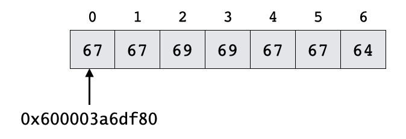
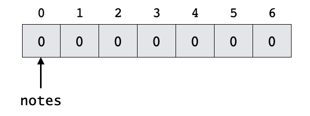
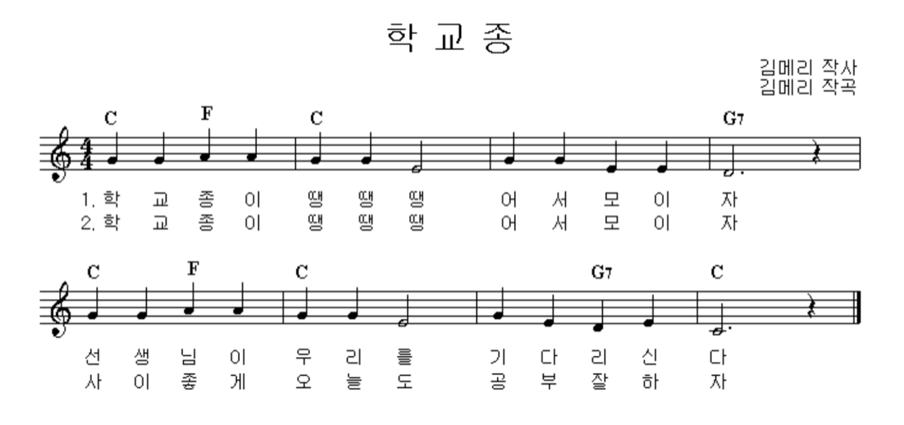
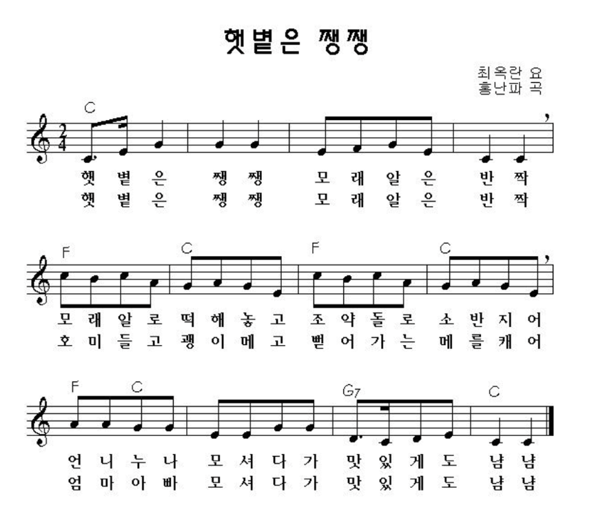

```
(c)도경구 version 0.3 (2021/09/30)
```

## 4. 배열

### 4-1. 배열의 선언과 지정

#### 배열의 표현

배열(array)은 같은 타입의 값들을 나란히 이어붙여 나열한 데이터 구조이다. 예를 들어 "학교종" 노래의 첫 두 마디의 MIDI 음을 ChucK의 배열로 표현하면 다음과 같다.

```
[67, 67, 69, 69, 67, 67, 64]
```

음을 차례로 쉼표로 구분하여 나열하고, 전체를 대괄호로 둘러싼다. 이 배열을 실행창에 프린트 해보면

```
<<< "The value of [67, 67, 69, 69, 67, 67, 64] =", [67, 67, 69, 69, 67, 67, 64] >>>;
```

다음과 같이 실행창에 나타난다.

```
The value of [67, 67, 69, 69, 67, 67, 64] = 0x600003a6df80
```

배열을 프린트해보니 정체 불명의 값이 나타난다. 무엇일까? 만든 배열이 저장되어 있는 주소를 프린트 해준 것이다. 이 배열을 그림으로 요약하여 표현하면 다음과 같다.



원소 값들을 메모리에 차례로 나란히 저장해두고 정수 인덱스를 0부터 시작하여 차례로 붙여두었다.

#### 배열의 선언

배열을 활용하기 위해서는 변수로 지정하고 인덱스를 활용하여 개별 접근해야 한다. 배열 변수는 다음과 같은 형식으로 선언한다.

```
int notes[7];
```

선언할 배열 원소의 타입을 앞에 명시하고, 이어서 배열 변수의 이름과 배열의 크기를 대괄호로 둘러싸 적는다. 이와 같이 선언하면 다음 그림과 같은 배열이 만들어진다. 원소의 값은 타입의 기본값으로 설정된다.`int` 타입은 `0`, `float` 타입은 `0.0`, `string` 타입은 `""`로 자동 설정된다.



#### 배열의 참조

이 배열 값은 다음과 같은 형식으로 인덱스를 명시하여 읽어올 수 있다.

```
for (0 => int i; i < 7; i++)
    <<< "notes[", i , "] =", notes[i] >>>;
```

실행하면 다음과 같이 실행창에서 확인해준다.

```
notes[ 0 ] = 0
notes[ 1 ] = 0
notes[ 2 ] = 0
notes[ 3 ] = 0
notes[ 4 ] = 0
notes[ 5 ] = 0
notes[ 6 ] = 0
```

#### 배열의 수정

배열의 원소 값은 개별적으로 다음과 같이 수정할 수 있다.

```
67 => notes[4];
```

위의 `for` 루프로 다시 읽어보면 다음과 같이 수정되었음을 확인할 수 있다.

```
notes[ 0 ] = 0
notes[ 1 ] = 0
notes[ 2 ] = 0
notes[ 3 ] = 0
notes[ 4 ] = 67
notes[ 5 ] = 0
notes[ 6 ] = 0
```

#### 배열의 지정

배열은 다음과 같은 형식으로 한꺼번에 지정할 수 있다.

```
[67, 67, 69, 69, 67, 67, 64] @=> notes;
```

배열을 한꺼번에 지정할 때는 `@` 기호를 반드시 붙여야 함을 주의하자. 위의 `for` 루프로 또 다시 읽어보면 다음과 같이 수정되었음을 확인할 수 있다.

```
notes[ 0 ] = 67
notes[ 1 ] = 67
notes[ 2 ] = 69
notes[ 3 ] = 69
notes[ 4 ] = 67
notes[ 5 ] = 67
notes[ 6 ] = 64
```

다음과 같은 형식으로 배열의 선언과 지정을 한꺼번에 할 수도 있다.

```
[67, 67, 69, 69, 67, 67, 64] @=> int notes[];
```

이 경우 만든 배열의 크기가 고정되어 있으므로 배열의 크기를 굳이 명시할 필요가 없다.

#### 배열 참조 오류

다음과 같이 배열의 인덱스 범위 바깥의 인덱스 값을 사용하면 `ArrayOutofBounds` 실행 오류가 발생하므로 주의해야 한다.

```
<<< notes[7] >>>;
```

#### 배열 보조 함수

##### 1. 배열 길이 계산 함수 : `int size()`

배열 `notes`의 길이는 다음과 같은 형식으로 알아낼 수 있다.

```
<<< "The length of notes =", notes.size() >>>;
```

실행하여 확인해보자.

##### 2. 배열 길이 조정 함수 : `int size(int n)`

이 함수를 활용하면 배열의 길이를 줄이거나 늘릴 수 있다.

다음과 같이 하면 배열의 앞부분을 원하는 만큼만 추릴 수 있고,

```
notes.size(4);
<<< "After notes.size(4)" >>>;
for (0 => int i; i < notes.size(); i++)
    <<< "notes[", i , "] =", notes[i] >>>;
```

다음과 같이 하면 배열의 길이를 원하는 만큼 늘릴 수 있다.

```
notes.size(12);
<<< "After notes.size(12)" >>>;
for (0 => int i; i < notes.size(); i++)
    <<< "notes[", i , "] =", notes[i] >>>;
```

추가된 뒷부분은 모두 `0`으로 설정된다. 실행하여 확인해보자.

##### 3. 배열 뒤에서 원소 하나 제거하기 : `void popBack()`

```
notes.popBack();
<<< "After notes.popBack()" >>>;
for (0 => int i; i < notes.size(); i++)
    <<< "notes[", i , "] =", notes[i] >>>;
```

실행하여 확인해보자.

##### 4. 배열 뒤에 원소 하나 추가하기 : `<<`

```
notes << 62;
<<< "After notes << 62" >>>;
for (0 => int i; i < notes.size(); i++)
    <<< "notes[", i , "] =", notes[i] >>>;
notes << 60;
<<< "After notes << 60" >>>;
for (0 => int i; i < notes.size(); i++)
    <<< "notes[", i , "] =", notes[i] >>>;
```

실행하여 확인해보자.

##### 5. 배열 지우기 : `void clear()`

```
notes.clear();
<<< "After notes.clear()" >>>;
<<< "The length of notes =", notes.size() >>>;
```

실행하여 확인해보자.

### 4-2. 배열 활용 사례 : 학교종



악보대로 연주하는 프로그램을 만들어보자.

#### MIDI음 번호 이름 붙이기

먼저 악보의 계명은 MIDI로 표현할 수 있다. 그런데 MIDI 번호를 계명별로 외우는 건 성가신 일이므로 다음과 같이 이름을 지정하여 이름을 대신 쓰도록 하면 편하다.

```
36 => int C2; 48 => int C3; 60 => int C4; 72 => int C5; 84 => int C6;
38 => int D2; 50 => int D3; 62 => int D4; 74 => int D5; 86 => int D6;
40 => int E2; 52 => int E3; 64 => int E4; 76 => int E5; 88 => int E6;
41 => int F2; 53 => int F3; 65 => int F4; 77 => int F5; 89 => int F6;
43 => int G2; 55 => int G3; 67 => int G4; 79 => int G5; 91 => int G6;
45 => int A2; 57 => int A3; 69 => int A4; 81 => int A5; 93 => int A6;
47 => int B2; 59 => int B3; 71 => int B4; 83 => int B5; 95 => int B6;
```

#### 진동기 설정 프로시저 함수 `setOsc` 만들기

다음 함수는 진동기 `osc`와 MIDI음 번호 `note`, 소리크기 `vol`을 받아서, `osc`의 주파수와 볼륨을 설정해주는 프로시저 함수이다.

```
fun void setOsc(Osc osc, int note, float vol) {
    if (note == -1) {
        0 => osc.gain;
        <<< "note =", "rest (zzz...)" >>>;
    }
    else {
        Std.mtof(note) => osc.freq;
        vol => osc.gain;
        <<< "note =", note, "volume =", vol >>>;
    }
}
```

#### 템포와 박자 설정

```
0.5::second => dur beat;
beat / 4 => dur REST;
beat - REST => dur QN; // quarter note
beat * 2 - REST => dur HN; // half note
beat * 3 - REST => dur DHN; // dotted half note
```

#### 악보의 배열 데이터 만들기

```
// melody
[
G4,G4,A4,A4, G4,G4,E4,
G4,G4,E4,E4, D4,-1,
G4,G4,A4,A4, G4,G4,E4,
G4,E4,D4,E4, C4,-1
] @=> int MELODY[];

// tempo
[
QN,QN,QN,QN, QN,QN,HN,
QN,QN,QN,QN, DHN,QN,
QN,QN,QN,QN, QN,QN,HN,
QN,QN,QN,QN, DHN,QN
] @=> dur DURS[];
```

#### 연주하기

```
SinOsc s => dac;

for (0 => int i; i < MELODY.size(); i++) {
    setOsc(s, MELODY[i], 0.5);
    DURS[i] => now;
    0 => s.gain;
    REST => now;
}
```

#### 베이스와 가사 추가

```
// bassline
[
C3,C3,F2,F2, C3,C3,C3,
C3,C3,A2,A2, G2,-1,
C3,C3,F2,F2, C3,C3,C3,  
C3,C3,G2,B2, C3,-1
] @=> int BASSLINE[];

// lyrics
[
"Hak","Gyo","Jong","I", "Ddaeng","Ddaeng","Ddaeng",
"Eo","Seo","Mo","I", "Ja","",
"Seon","Saeng","Nim","I", "U","Ri","Reul",
"Gi","Da","Ri","Sin", "Da",""
] @=> string LYRICS[];
```

#### 다시 연주하기

```
SinOsc s => dac;
TriOsc t => dac;

for (0 => int i; i < MELODY.size(); i++) {
    setOsc(s, MELODY[i], 0.6);
    setOsc(t, BASSLINE[i], 0.1);
    <<< LYRICS[i], "" >>>;
    DURS[i] => now;
    0 => s.gain => t.gain;
    REST => now;
}   
```

### [실습 1] For Elise

다음은 베토벤의 `엘리제를 위하여`의 도입 부분의 악보이다. 
이를 연주하는 프로그램을 MIDI와 배열을 사용하여 작성해보자.


```
// tempo
0.3::second => dur BEAT;
BEAT => dur SN; // sixteenth (1/16)
BEAT * 2 => dur EN; // eighth (1/8)

// For Elise by Beethoven
[
76, 75, 76, 75, 76, 71, 74, 72, 69, -1,
60, 64, 69, 71, -1, 64, 68, 71, 72, -1, 64,
76, 75, 76, 75, 76, 71, 74, 72, 69, -1,
60, 64, 69, 71, -1, 64, 72, 71, 69, -1
] @=> int MELODY[];
[
SN, SN, SN, SN, SN, SN, SN, SN, EN, SN,
SN, SN, SN, EN, SN, SN, SN, SN, EN, SN, SN,
SN, SN, SN, SN, SN, SN, SN, SN, EN, SN,
SN, SN, SN, EN, SN, SN, SN, SN, EN, EN
] @=> dur DURS[];
```

악보에 표시된 대로 두 번 반복해야 한다.

그리고 악보에 연속 이어지는 음이 없으므로,
음의 끝 부분의 소리를 죽이지 말고 박자 전체를 소리나게 한다.

### [실습 2] Theme from Beverly Hill Cops

Beverly Hill Cops 영화 주제곡 도입 부분을 `TriOsc`로 연주하는 프로그램을 작성하자.
악보와 템포는 다음 코드를 활용한다.

```
// tempo
0.25::second => dur BEAT; // basic duration
BEAT / 5 => dur REST; // duration of no sound after each note
BEAT => dur QN; // quarter (1/4) note sound
BEAT * 2 => dur HN; // half (1/2) note sound
BEAT / 2 => dur EN; // eighth (1/8) note sound

// Harold Faltermeyer's Theme from the film Beverly Hills Cop (1984)
[
65, -1, 68, -1, 65, 65, 70, 65, 63,
65, -1, 72, -1, 65, 65, 73, 72, 68,
65, 72, 77, 65, 63, 63, 60, 67, 65] @=> int melody[];
[
QN, QN, QN, EN, QN, EN, QN, QN, QN,
QN, QN, QN, EN, QN, EN, QN, QN, QN,
QN, QN, QN, EN, QN, EN, QN, QN, HN] @=> dur durs[];
```

MIDI 음 배열의 `-1`은 쉼표를 나타낸다. 
같은 음이 이어지는 경우에만 두 음이 끊어져 들리도록 `REST` 변수를 활용하고, 다른 음은 음이 이어져 들리도록 한다.


### [숙제] 반달

두 개의 `Osc`를 활용하여 하나는 악보에 있는대로 멜로디를 연주하고, 다른 하나는 화음에 맞추어 다른 음을 연주하는 프로그램을 작성하자.


### 추가 연습 문제 : 햇볕은 쨍쨍




