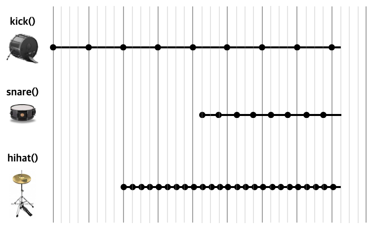
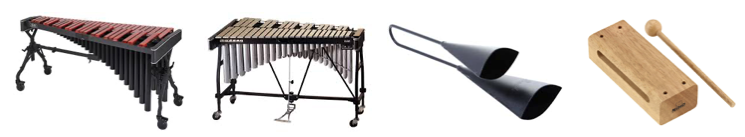
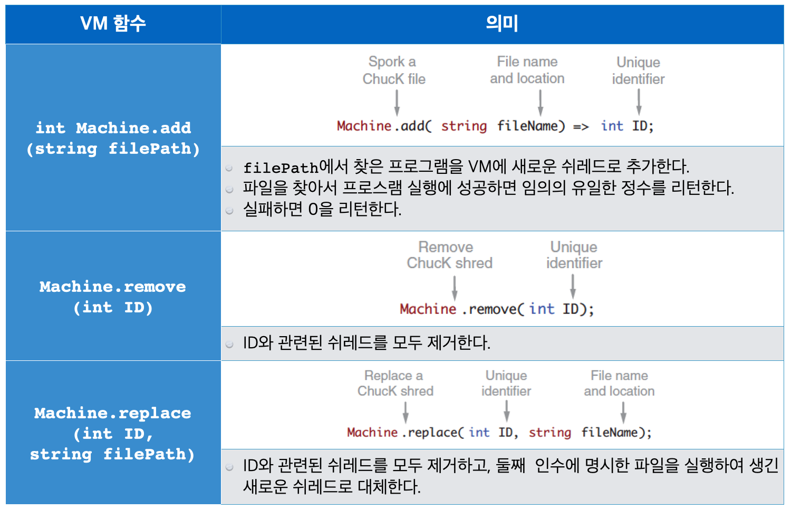
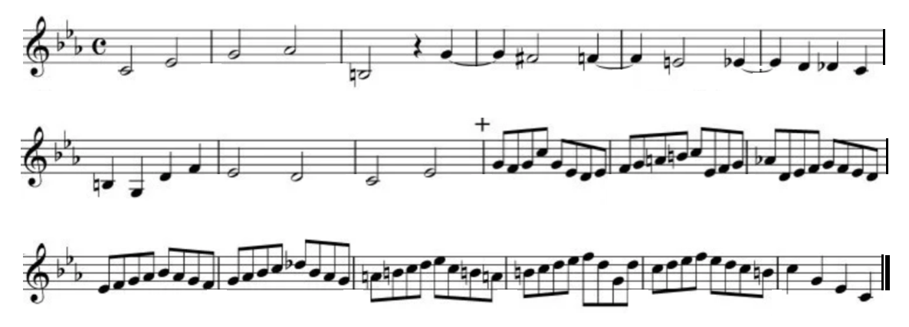
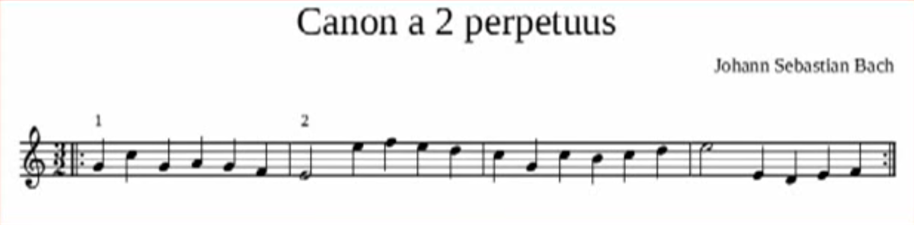
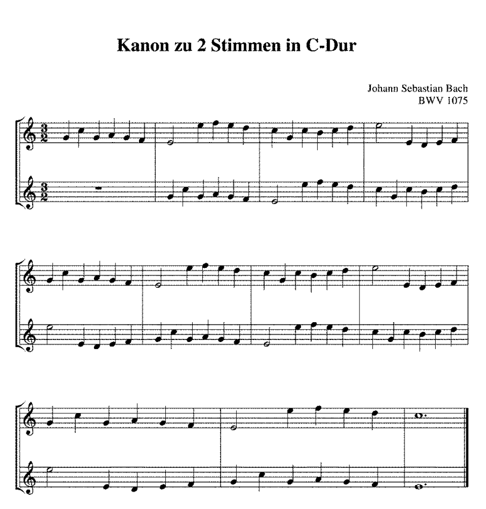
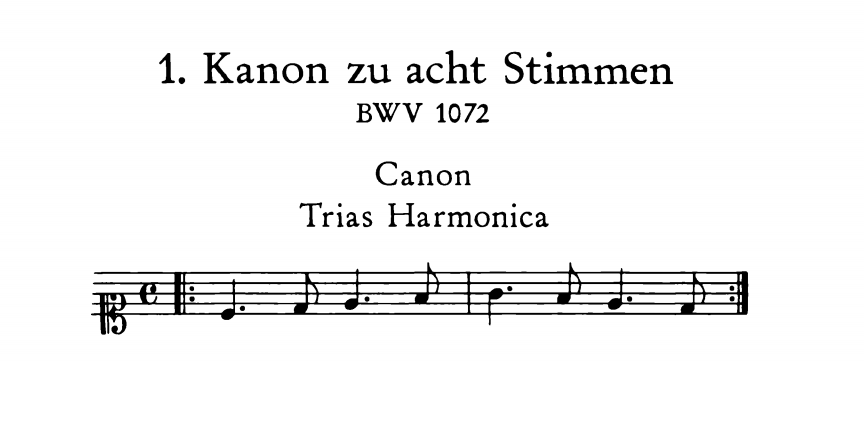

```
(c)도경구 version 0.21 (2021/10/28)
```

## 7. 멀티스레드와 동시 계산

- <b>동시 계산 (concurrency)</b> : 다른 계산을 동시에 수행함
- <b>동시 계산 프로그램 (concurrent programs)</b> : 상호 연관성이 있는 독립적인 두 개 이상의 코드가 동시에 서로 동기화를 하면서 실행하는 프로그램
- ChucK은 시간(`time`)을 중심으로 박자에 맞추어 동기화를 하는 동시 계산 프로그램을 작성하도록 설계, 구현된 프로그래밍 언어

| 용어 | 설명 | ChucK | 
|:----:|:----:|:----:|
| 쓰레드(thread) | 프로그램 실행 흐름 줄기 | shred = strand + thread |
| 멀티쓰레드(multithread) | 실행중 동시에 여러 독립적인 쓰레드가 존재 (서로를 알 필요가 없음) | multishred|
| 포크(fork) | 부모 쓰레드가 자식 쓰레드를 만들어 냄 | `spork` |
| 스케줄러(scheduler) | 부모(선조) 쓰레드와 자식(자손) 쓰레드를 동기화 시키는 장치 | shreduler |


```
// Tempo
0.25::second => dur BEAT;
BEAT => dur QN; // Quarter Note
BEAT * 4 => dur WN; // Whole Note

fun void ping() {
    Impulse pin => ResonZ rez => dac;
    700 => rez.freq;
    50 => rez.Q;
    while (true) {
        <<< "ping!", "" >>>;
        100 => pin.next;
        WN => now;
    }
}

fun void pong() {
    Impulse pon => ResonZ rez => dac;
    800 => rez.freq;
    50 => rez.Q;
    while (true) {
        <<< "pong!", "" >>>;
        100 => pon.next;
        QN => now;
    }
}

// create two children shreds
spork ~ ping();
spork ~ pong();

// a parent shred
while (true) 
    WN => now;
```

- 쉬레드(shred)는 시간에 맞추어 동기화하며, 동기화 시기는 프로그램으로 결정한다. 
- `spork ~ <함수 호출>` 로 새로운 자식 쉬레드를 만든다.
- 자식 쉬레드 수에는 제한이 없다.
- 부모가 없어지면 자식을 포함한 자손은 모두 없어진다.


### 7-1. 동시 계산 프로그램 사례 1 : 드럼 머신



```
// Drum Machine

// Tempo
0.25::second => dur BEAT;
BEAT => dur QN; // Quarter Note
BEAT * 2 => dur HN; // Half Note
BEAT * 4 => dur WN; // Whole Note

fun void kick() {
    SndBuf kick => dac;
    me.dir()+"/audio/kick_01.wav" => kick.read;
    while (true) {
        WN => now;
        0 => kick.pos;
    }
}

fun void snare() {
    SndBuf snare => dac;
    me.dir()+"/audio/snare_01.wav" => snare.read;
    while (true) {
        HN => now;
        0 => snare.pos;
    }
}

fun void hihat() {
    SndBuf hihat => dac;
    me.dir()+"/audio/hihat_01.wav" => hihat.read;
    0.2 => hihat.gain;
    while (true) {
        QN => now;
        0 => hihat.pos;
    }
}

spork ~ kick();
WN * 2 => now;
spork ~ hihat(); 
WN * 2 => now;
QN => now;
spork ~ snare();
WN * 4 => now;
// then go on forever
while (true) {
    WN => now;    
}
```


### 7-2. 동시 계산 프로그램 사례 2 : 반달


#### 사례 : 반달 멜로디를 반주와 함께 연주하기

앞에서 공부한 `반달`의 첫 네 마디를 연주하는 프로그램을 만들어보자.
이번엔 멜로디와 반주를 독립적인 쉬레드로 만들어 동시에 따로 연주하도록 해보자. 

```
fun void righthand() {
    Rhodey piano => dac;
    [67,69, 67,64, 67,64,60, 55] @=> int MELODY[];
    [2,1,   2,1,   1,1,1,    3] @=> int LEN[];
    for (0 => int i; i < MELODY.size(); i++) {
        Std.mtof(MELODY[i]) => piano.freq;
        1 => piano.noteOn;
        LEN[i]::second / 2 => now;
        0 => piano.noteOff;
    }
}
```

```
fun void lefthand() {
    Wurley piano => dac;
    [48,52,55, 48,52,55, 48,52,55, 48,52,55] @=> int HARMONY[];
    [1,1,1,    1,1,1,    1,1,1,    1,1,1] @=> int LEN[];
    for (0 => int i; i < HARMONY.size(); i++) {
        Std.mtof(HARMONY[i]) => piano.freq;
        1 => piano.noteOn;
        LEN[i]::second / 2 => now;
        0 => piano.noteOff;
    }
}
```

```
righthand();
lefthand();
```

```
spork ~ righthand();
spork ~ lefthand();
6::second => now;
```

### 7-3. 동시 계산 활용 사례 : 여러 쉬레드가 공동으로 `UGen` 제어

먼저 STK 악기 `StkInstrument` 중에서 타악기 류를 알아보자.

#### `ModalBar`



```
// Demo of modal bar presets
ModalBar bar => dac;

[62, 64, 66, 67, 69, 71, 73, 74] @=> int scale[];

for (0 => int i; i <= 8; i++) {
    i => bar.preset;
    for (0 => int j; j < scale.cap(); j++) {
        Std.mtof(scale[j]) => bar.freq;
        1 => bar.noteOn;
        0.4 :: second => now;
    }
}
```

이 타악기를 활용하여 재미있는 소리를 내는 프로그램을 공부해보자.

```
ModalBar modal => NRev reverb => dac;
.1 => reverb.mix;
7 => modal.preset;
.9 => modal.strikePosition;

// spork detune() as a child shred
// note: must do this before entering into infinite loop below!
spork ~ detune();  

// infinite time loop
while (true) {
    1 => modal.strike;
    250::ms => now;
    .7 => modal.strike;
    250::ms => now;
    .9 => modal.strike;
    250::ms => now;
    repeat (4) {
        .5 => modal.strike;
        62.5::ms => now;
    }
}

// function to vary tuning over time
fun void detune() {
    while (true) {
        // update frequency sinusoidally
        84 + Math.sin(now/second*.25*Math.PI) * 2 => Std.mtof => modal.freq;
        // advance time (controls update rate)
        5::ms => now;
    }
}
```

### 7-4. ChucK 프로그램 파일을 쉬레드로 추가 - `Machine`



```
Machine.add(me.dir()+"/pingpong.ck") => int pingpong;
2.0 :: second => now;
Machine.add(me.dir()+"/drummachine.ck") => int drum;
6.0 :: second => now;
Machine.add(me.dir()+"/modalbar.ck") => int modal;
4.0 :: second => now;             
Machine.remove(modal);
4.0 :: second => now;
Machine.replace(drum,me.dir()+"/modalbar.ck") => modal;
4.0 :: second => now;
Machine.remove(modal);
4.0 :: second => now;
Machine.remove(pingpong);
```

### 7-5. 사례 학습 : Jazz Quartet Band

- 관악기 : `Flute`
- 피아노 : `Rhodey`
- 베이스 : `Mandolin`
- 드럼 : `SndBuf`

#### `piano.ck`

```
Rhodey piano[4];
piano[0] => dac;
piano[1] => dac;
piano[2] => dac;             
piano[3] => dac;

[[53,57,60,64],[51,55,60,63]] @=> int chord[][]; 

while( true ) {
    for (0 => int i; i < 4; i++)  { 
        Std.mtof(chord[0][i]) => piano[i].freq;
        Math.random2f(0.3,.7) => piano[i].noteOn;
    }
    1.0 :: second => now;
    for (0 => int i; i < 4; i++) {
        Math.mtof(chord[1][i]) => piano[i].freq;
        Math.random2f(0.3,.7) => piano[i].noteOn;
    }
    1.4 :: second => now;
}
```

#### `bass.ck`

```
Mandolin bass => NRev r => dac;
0.1 => r.mix; 
0.0 => bass.stringDamping; // makes strings ring a long time. 
0.02 => bass.stringDetune; 
0.05 => bass.bodySize; // gives a huge body size.
.5 => bass.gain;

[41,43,45,48,50,51,53,60,63] @=> int scale[]; 
4 => int walkPos;
scale.size() => int size;

while (true) {
    Math.random2(-1,1) +=> walkPos;
    if (walkPos < 0) 
        1 => walkPos;
    if (walkPos >= size) 
        size - 2 => walkPos;
    Std.mtof(scale[walkPos]-12) => bass.freq;
    Math.random2f(0.05,0.5) => bass.pluckPos;
    1 => bass.noteOn;
    0.55 :: second => now;
    1 => bass.noteOff;
    0.05 :: second => now;
}
```


#### `drums.ck`

```
SndBuf hihat => dac; 
me.dir(-1) + "/audio/hihat_01.wav" => hihat.read;

while (true) {
    Math.random2f(0.1,.3) => hihat.gain;
    Math.random2f(.9,1.2) => hihat.rate;
    (Math.random2(1,2) * 0.2)::second => now;
    0 => hihat.pos;
}
```


#### `flute.ck`

```
Flute solo => JCRev rev => dac;
0.1 => rev.mix;
solo => Delay d => d => rev;
0.8::second => d.max => d.delay;
0.5 => d.gain;
0.5 => solo.gain;

[41,43,45,48,50,51,53,60,63] @=> int scale[];

while (true) {
    (Math.random2(1,5)*0.2)::second => now; // 0.2, 0.4, 0.6, 0.8, 1.0
    if (Math.random2(0,3) > 1) { // 50%
        Math.random2(0,scale.size()-1) => int note; 
        Math.mtof(scale[note]+24)=> solo.freq;
        Math.random2f(0.3,1.0) => solo.noteOn;
    }
    else // 50%
        1 => solo.noteOff; 
}
```


#### `score.ck`

```
Machine.add(me.dir()+"/piano.ck") => int pianoID;
4.8::second => now;
me.dir()+"/drums.ck" => string drumsPath;
Machine.add(drumsPath) => int drumsID;
4.8::second => now;
Machine.add(me.dir()+"/bass.ck") => int bassID;
4.8::second => now;
Machine.add(me.dir()+"/flute.ck") => int fluteID;
4.8::second => now;
Machine.remove(drumsID);
4.8::second => now;
Machine.remove(fluteID);
4.8::second => now;
Machine.remove(bassID);
4.8::second => now;
Machine.remove(pianoID);
```

#### `initialize.ck`

```
me.dir() + "/score.ck" => string scorePath;
Machine.add(scorePath);
```

### MIDI 챠트

```
// MIDI
36 => int C2;  48 => int C3;  60 => int C4;  72 => int C5;  84 => int C6;
37 => int Cs2; 49 => int Cs3; 61 => int Cs4; 73 => int Cs5; 85 => int Cs6;
37 => int Db2; 49 => int Db3; 61 => int Db4; 73 => int Db5; 85 => int Db6;
38 => int D2;  50 => int D3;  62 => int D4;  74 => int D5;  86 => int D6;
39 => int Ds2; 51 => int Ds3; 63 => int Ds4; 75 => int Ds5; 87 => int Ds6;
39 => int Eb2; 51 => int Eb3; 63 => int Eb4; 75 => int Eb5; 87 => int Eb6;
40 => int E2;  52 => int E3;  64 => int E4;  76 => int E5;  88 => int E6;
41 => int F2;  53 => int F3;  65 => int F4;  77 => int F5;  89 => int F6;
42 => int Fs2; 54 => int Fs3; 66 => int Fs4; 78 => int Fs5; 90 => int Fs6;
42 => int Gb2; 54 => int Gb3; 66 => int Gb4; 78 => int Gb5; 90 => int Gb6;
43 => int G2;  55 => int G3;  67 => int G4;  79 => int G5;  91 => int G6;
44 => int Gs2; 56 => int Gs3; 68 => int Gs4; 80 => int Gs5; 92 => int Gs6;
44 => int Ab2; 56 => int Ab3; 68 => int Ab4; 80 => int Ab5; 92 => int Ab6;
45 => int A2;  57 => int A3;  69 => int A4;  81 => int A5;  93 => int A6;
46 => int As2; 58 => int As3; 70 => int As4; 82 => int As5; 94 => int As6;
46 => int Bb2; 58 => int Bb3; 70 => int Bb4; 82 => int Bb5; 94 => int Bb6;
47 => int B2;  59 => int B3;  71 => int B4;  83 => int B5;  95 => int B6;
-1 => int REST;
```

### 실습

#### 1. `playNote`, `play` 함수 만들기


<b>1-1.</b> 
`StkInstrument` 악기 `instrument`, `int` 타입의 MIDI 음 `note`, `dur` 타입의 재생시간 `duration`을 인수로 받아서, `instrument`로 `note` 음을 `duration` 재생시간 동안 스피커로 출력하는 프로시저 함수 `playNote`를 작성하자.

```
fun void playNote(StkInstrument instrument, int note, dur duration) {

}
```


<b>1-2.</b> 
`StkInstrument` 악기 `instrument`, `int` 타입의 MIDI 음 배열 `notes[]`, `dur` 타입의 재생시간 `durs[]` 배열을 인수로 받아서, `instrument`로 `notes[]` 배열의 음을 `durs[]` 배열의 재생시간에 맞추어 순서대로 스피커로 출력하는 프로시저 함수 `play`를 `playNote` 함수를 활용하여 작성하자.

```
fun void play(StkInstrument instrument, int notes[], dur durs[]) {

}
```

<b>1-3.</b> 
다음 악보를 `play` 함수를 활용하여 자신이 선호하는 악기로 연주하는 프로그램을 작성하자.


```
0.4::second => dur BEAT;
BEAT / 2 => dur EN; // eighth note (1/8)
BEAT     => dur QN; // quarter note (1/4)
BEAT * 2 => dur HN; // half note (1/2)

[
F4,G4,A4,F4, F4,G4,A4,F4, A4,Bb4,C5, A4,Bb4,C5,
C5,D5,C5,Bb4,A4,F4, C5,D5,C5,Bb4,A4,F4, F4,C4,F4, F4,C4,F4
] @=> int MELODY[];

[
QN,QN,QN,QN, QN,QN,QN,QN, QN,QN,HN, QN,QN,HN,
EN,EN,EN,EN,QN,QN, EN,EN,EN,EN,QN,QN, QN,QN,HN, QN,QN,HN
] @=> dur DURS[];
```


#### 2. 여러 음 동시에 내기

다음 악보는 멜로디의 뒤 두 마디에 높은 음이 화음으로 추가되고, 아래에 베이스 음이 추가되어 있다. 


3개의 다른 음을 동시에 내어 화음을 이루어 연주하도록 프로그램을 작성하자. 

```
[
F4,G4,A4,F4, F4,G4,A4,F4, A4,Bb4,C5, A4,Bb4,C5,
C5,D5,C5,Bb4,A4,F4, C5,D5,C5,Bb4,A4,F4, F4,C4,F4, F4,C4,F4
] @=> int MELODY[];

[
F4,G4,A4,F4, F4,G4,A4,F4, A4,Bb4,C5, A4,Bb4,C5,
C5,D5,C5,Bb4,A4,F4, C5,D5,C5,Bb4,A4,F4, A4,E4,A4, A4,E4,A4
] @=> int MELODY_HIGH[];

[
QN,QN,QN,QN, QN,QN,QN,QN, QN,QN,HN, QN,QN,HN,
EN,EN,EN,EN,QN,QN, EN,EN,EN,EN,QN,QN, QN,QN,HN, QN,QN,HN
] @=> dur DURS[];

[
F3,C4,F3, F3,C4,F3, F3,C4,F3, F3,C4,F3,
F3,C4,F3, F3,C4,F3, F3,C4,F3, F3,C4,F3
] @=> int BASS[];

[
QN,QN,HN, QN,QN,HN, QN,QN,HN, QN,QN,HN,
QN,QN,HN, QN,QN,HN, QN,QN,HN, QN,QN,HN
]
@=> dur DURS_BASS[];
```

3개의 음이 동시에 나는 경우 음량이 더해져서 듣기 거북할 만큼 커진다.
따라서 전체 음량의 합이 1.0 이하가 되도록 조절하는 것이 좋다.
따라서 음량을 지정할 인수가 추가된 `play` 함수를 다음과 같은 형식으로 추가 작성하여 사용하자.

```
fun void play(StkInstrument instrument, int notes[], dur durs[], float volume) {

}
```

#### 3. 돌림노래

이번엔 다음 곡을 돌림노래로 연주해보자. 


4개의 개별 개체를 만들어 차례로 2 마디씩 늦게 연주를 시작하도록 하면 돌림노래가 완성된다. 
악기는 자유로이 선택한다.

```
0.2::second => dur BEAT;
BEAT => dur SN; // sixth note (1/6)
BEAT * 2 => dur TN; // third note (1/3)
BEAT * 3 => dur HN; // half note (1/2)
BEAT * 6 => dur WN; // whole note (1)

[
C4,C4, C4,D4,E4, E4,D4,E4,F4, G4,
C5,C5,C5,G4,G4,G4, E4,E4,E4,C4,C4,C4, G4,F4,E4,D4, C4
] @=> int MELODY[];

[
HN,HN, TN,SN,HN, TN,SN,TN,SN, WN,
SN,SN,SN,SN,SN,SN, SN,SN,SN,SN,SN,SN, TN,SN,TN,SN, WN
] @=> dur DURS[];
```

#### 4. Bach의 Crab Canon

- [Crab Canon?](https://www.youtube.com/watch?v=DAIc1XvnPkI)

다음 악보는 바하의 The Musical Offering에 포함되어 있는 Crab Canon으로 음악적 팰린드롬이다. 




그냥 순서대로 또는 거꾸로 한방향으로 연주해도 되고, 순서대로와 거꾸로를 동시에 양방향으로 연주해도 된다. 들어보자.

- [Bach’s Crab Canon](https://www.youtube.com/watch?v=36ykl2tJwZM)

- [Bach’s Crab Canon 연주](https://www.youtube.com/watch?v=miGuET40U7I)

이 곡을 두개의 악기를 사용하여 정방향과 역방향으로 동시에 연주하는 프로그램을 아래 MIDI 악보 코드를 활용하여 만들어보자. 힌트: 악보를 거꾸로 연주하는 함수 `retrograde`를 따로 작성하여 사용하자.


```
// Tempo
0.4::second => dur BEAT;
BEAT => dur QN;
BEAT / 2 => dur EN;
BEAT * 2 => dur HN;

// Bach Canon Score
[
C4,Eb4,       G4,Ab4,  B3,REST,G4,                                           
Fs4,F4,       E4,Eb4,  D4,Db4,C4,
B3,G3,D4,F4,  E4,D4,   C4,Eb4,                      
G4,F4,G4,C5,G4,Eb4,D4,Eb4,    F4,G4,A4,B4,C5,Eb4,F4,G4,    
Ab4,D4,Eb4,F4,G4,F4,Eb4,D4,   Eb4,F4,G4,Ab4,Bb4,Ab4,G4,F4, 
G4,Ab4,Bb4,C5,Db5,Bb4,Ab4,G4, A4,B4,C5,D5,Eb5,C5,B4,A4,    
B4,C5,D5,Eb5,F5,D5,G4,D5,     C5,D5,Eb5,F5,Eb5,D5,C5,B4,   
C5,G4,Eb4,C4
] @=> int NOTES[];

[
HN,HN,        HN,HN,   HN,QN,HN, 
HN,HN,        HN,HN,   QN,QN,QN,
QN,QN,QN,QN,  HN,HN,   HN,HN,
EN,EN,EN,EN,EN,EN,EN,EN,      EN,EN,EN,EN,EN,EN,EN,EN,
EN,EN,EN,EN,EN,EN,EN,EN,      EN,EN,EN,EN,EN,EN,EN,EN,
EN,EN,EN,EN,EN,EN,EN,EN,      EN,EN,EN,EN,EN,EN,EN,EN,
EN,EN,EN,EN,EN,EN,EN,EN,      EN,EN,EN,EN,EN,EN,EN,EN,
QN,QN,QN,QN
] @=> dur DURS[];
```

#### 5. J.S. Bach, Canon a 2 perpetuus (BWV 1075)




다음 프로그램은 위 악보를 연주한다. 실행하여 멜로디를 들어보자.

```
// Tempo
0.4::second => dur BEAT;
BEAT => dur QN;
BEAT * 2 => dur HN;
BEAT * 6 => dur WN;

// Score
[
G4,C5,G4,A4,G4,F4,
E4,   E5,F5,E5,D5,
C5,G4,C5,B4,C5,D5,
E5,   E4,D4,E4,F4
] @=> int MELODY[];

[
QN,QN,QN,QN,QN,QN,
HN,   QN,QN,QN,QN,
QN,QN,QN,QN,QN,QN,
HN,   QN,QN,QN,QN
] @=> dur DURS[];

// Set up instrument and play
Rhodey hand => dac;
play(hand, MELODY, DURS);
```

아래 악보는 위의 멜로디 주제를 시간 차를 두고 두 악기가 반복 연주하도록 만든 캐논이다.
이 악보를 연주하는 프로그램을 작성하자. 
악보의 끝 부분에서 같이 끝나도록 하기 위해서 멜로디 주제를 일부만 연주함에 유의하여 작성하자.





### 숙제 : J.S. Bach, Trias Harmonica Canon (BWV 1072) [마감: 11월 2일 아침 9시]

다음 악보는 바하의 캐논 BWV 1072의 기본 테마 멜로디 악보이다.



장3화음인 도-미-솔과 단3화음인 레-파-라의 음을 하나씩 교대로 나열하여 만들 간단한 멜로디이다. 계명으로 읽으면 도-레-미-파-솔-파-미-레 이다. 장3화음 음의 길이는 한박자반으로 절대자 신을, 단3화음 음의 길이는 반박자로 인간을 나타낸다고 한다. 음의 길이가 3:1로 신과 인간의 삼위일체 관계를 의미한다고 한다. 아마도 신과 인간과의 관계를 음악으로 표현하려 한 것으로 보인다.

이 캐논은 이 테마 멜로디와 테마의 앞 뒤 마디를 뒤집은 멜로디를 교대로 4번씩 조금씩의 시차를 두고 돌림으로 연주한다.
다음 영상의 구체적인 악보 패턴 진행을 참고하여, 이와 똑같이 연주하도록 프로그램을 작성하자.

- [Trias Harmonica Canon의 작곡 원리](https://www.youtube.com/watch?v=AE3SW3wwP0s)

- [연주](https://www.youtube.com/watch?v=sjfN4iV0cqA)


