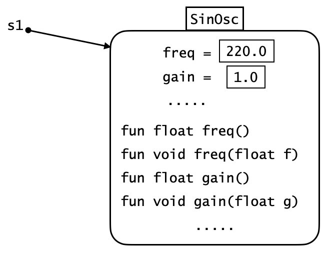
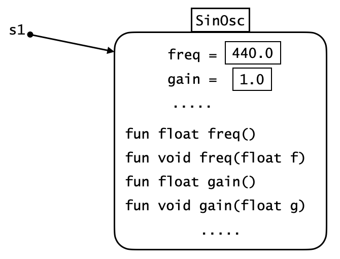
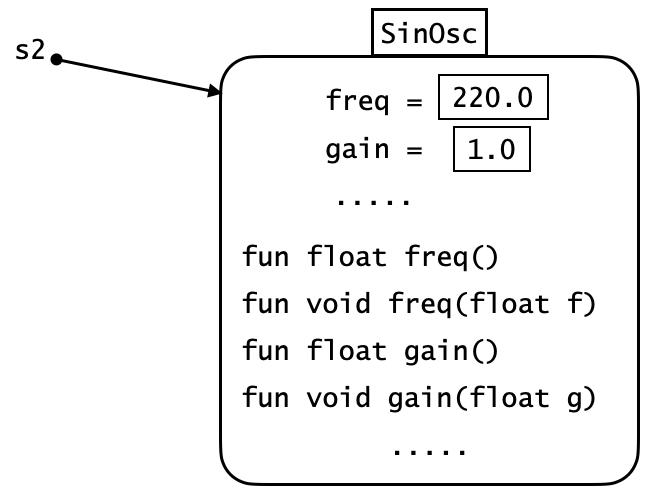
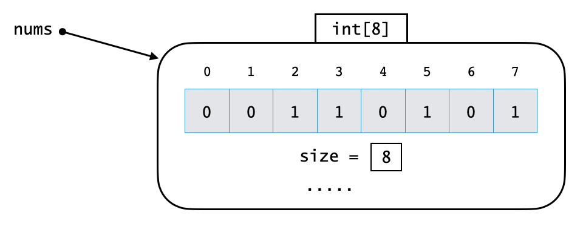
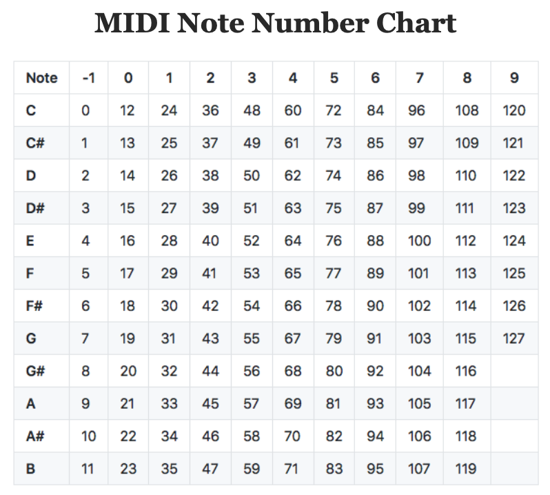
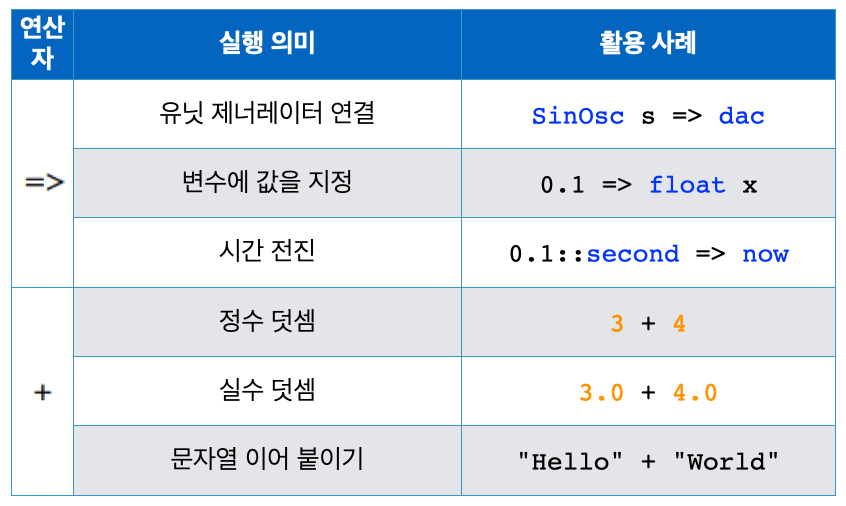
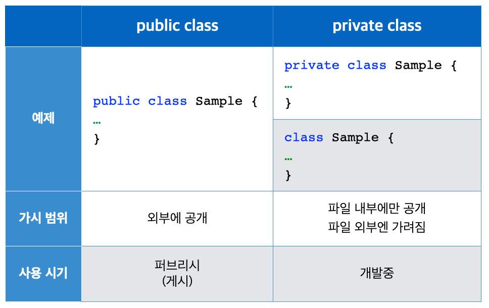
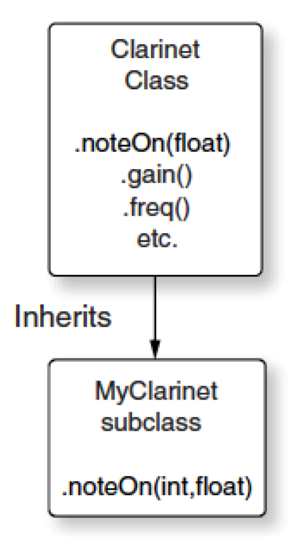
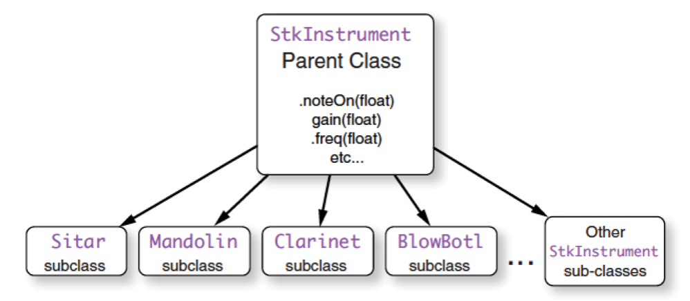

```
(c)도경구 version 0.1 (2021/11/1)
```

## 8. 객체지향 프로그래밍

### 8-1. 모두가 객체

ChucK 프로그래밍언어는 객체지향 프로그래밍 언어(object-oriented programming language)이다. 
계산의 대상이 되는 주요 데이터는 모두 객체(object)이며, 프로그램은 실행하면서 필요한 대로 객체를 만들어 메모리에 등장시킨다. 메모리에 거주하는 객체는 각자 고유의 특징과 상태를 필드변수(field)에 기억하고 있으며, 고유의 기능을 메소드(method)라는 함수로 갖추고 있어서 객체들끼리 메소드 호출 메시지를 주고 받으며 상태를 참고하거나 변경하면서 계산을 수행한다. 
클래스(class)는 객체를 만드는 일종의 형틀(template) 프로그램 이다.

우리가 알고있는 진동기도 객체이다.
예를 들어 다음과 같이 `SinOsc` 진동기를 하나 설치하고 이름을 붙이면, 

```
SinOsc s1;
```

메모리에 객체가 다음 그림과 같은 모양으로 생긴다고 상상할 수 있다. 



`s1` 이름으로 언제든지 이 `SinOsc` 진동기 객체에 접근할 수 있다.
다음과 같은 형식으로 메소드 호출 메시지를 보내서 주파수 정보를 알아볼 수도 있다.

```
<<< s1.freq() >>>;
```

이 객체의 주파수 변경은 다음과 같은 두 가지 형식으로 가능하다.

```
s1.freq(440.0);
440.0 => s1.freq;
```

변경 후 `SinOsc` 진동기 객체는 다음과 같다.



`SinOsc` 진동기를 필요한 대로 몇개든 설치할 수 있다. 
각 진동기는 이름을 다르게 붙여서 구별한다.

```
SinOsc s2;
```

그러면 메모리에 똑 같은 `SinOsc` 객체가 새로 또 하나 생긴다.



사실 `UGen`은 모두 객체이다. 심지어는 버철머신 `Machine`도 객체이다.

배열도 객체이다.
다음과 같이 배열을 만들어 선언하면,
```
[0,0,1,1,0,1,0,1] @=> int nums[];
``` 

메모리에 배열 객체가 다음 그림과 같은 모양으로 생긴다고 상상할 수 있다. 




### 8-2. 클래스 만들기

### 사례 1 : 클래스 정의 및 객체 생성

```
public class PianoKey {
    60 => int note;
    1.0 => float gain;
    
    fun int changeOctave() {
        return note + 12;
    }

    fun int changeOctave(int n) {
        return note + n * 12;
    }
}

PianoKey key;
<<< key.note, key.gain, key.changeOctave() >>>;

2 +=> key.note;
0.3 -=> key.gain;
<<< key.note, key.gain, key.changeOctave(-1) >>>;
```

### 사례 2 : 클래스 정의 및 객체 생성

```
public class ResonantPop {
    Impulse imp => ResonZ filt => dac;
    100.0 => filt.Q => filt.gain;
    1000.0 => filt.freq;

    fun void freq(float freq) {
        freq => filt.freq;
    }

    fun void setQ(float Q) {
        Q => filt.Q;
    }

    fun void setGain(float gain) {
        filt.Q() * gain => imp.gain;
    }

    fun void noteOn(float volume) {
        volume => imp.next;
    }
}

ResonantPop pop;

while (true) {
    Std.rand2f(1100.0,1200.0) => pop.freq;
    1 => pop.noteOn;
    0.1 :: second => now;
}
```

### 사례 3 : 메소드 중복

```
public class ResonantPop {
    Impulse imp => ResonZ filt => dac;
    100.0 => filt.Q => filt.gain;
    1000.0 => filt.freq;

    fun void freq(float freq) {
        freq => filt.freq;
    }
    
    fun void freq(int note) {
        Std.mtof(note) => filt.freq;
    }
        
    fun void freq(string name) {
        [21,23,12,14,16,17,19] @=> int notes[]; // A0,B0,C0,D0,E0,F0,G0
        name.chatAt(0) - 65 => int base; // A=0,B=1,C=2,D=3,E=4,F=5,G=7
        notes[base] => int note;
        if (0 <= base && base <= 6) {
            if (name.charAt(1) == '#' || name.charAt(1) == 's') // sharp
                notes[base] + 1 => note;
            if (name.charAt(1) == 'b' || name.charAt(1) == 'f') // flat
                notes[base] - 1 => note;
        }
        else
            <<< "Illegal Note Name!" >>>;
        name.chatAt(name.length()-1) - 48 => int oct; // 0, 1, 2, ..., 9
        if (0 <= oct && oct <= 9) {
            12 * oct +=> note;
            this.freq(note);
        }
        else
            <<< "Illegal Octave!" >>>;
    }

    fun void setQ(float Q) {
        Q => filt.Q;
    }

    fun void setGain(float gain) {
        filt.Q() * gain => imp.gain;
    }

    fun void noteOn(float volume) {
        volume => imp.next;
    }
}
```




### ChucK 중복 연산자 




### `public`과 `private` 클래스 비교

클래스를 위와 같이 `public` 키워드를 앞에 붙여서 선언하고 실행하면, 선언한 클래스가 버철 머신에 등록되면서 이후에 어떤 프로그램에서든지 접근하여 사용할 수 있게 된다. 클래스에 수정이 필요하여, 수정 후 재실행하면 이미 해당 클래스가 존재하므로 버철머신이 실행을 허용하지 않는다. `Clear VM` 버튼을 눌러 버철머신을 초기화 시키는 수밖에 없다. 

`public` 대신 `private`을 붙여두면, 이러한 문제가 발생하지 않는다. 따라서 프로그램 개발 중에는 `public`을 붙이지 않고, `private`을 붙여서 작업하는게 좋다. 일단 프로그램이 완성되어 게시할 때에 `public`으로 고쳐주면 된다. 




### 사례 4 : `public` 클래스

#### `BPM.ck`

```
public class BPM { // Beats Per Minute
    // globally accessible variables 
    dur quarterNote, eighthNote, sixteenthNote, thirtysecondNote;
    
    fun void tempo(float beat) { // beat in BPM
        60.0 / beat => float SPB; // Seconds Per Beat  
        SPB::second => quarterNote;
        quarterNote / 2.0 => eighthNote;
        quarterNote / 4.0 => sixteenthNote;
        quarterNote / 8.0 => thirtysecondNote;
    }
}
```

#### `useBPM1.ck`

```
SinOsc s => dac;
0.3 => s.gain;
BPM t;
t.tempo(300);

400 => int freq;
while (freq < 800) {
    freq => s.freq;
    t.quarterNote => now;
    50 +=> freq;
}
``` 

#### `useBPM2.ck`

```
SinOsc s => dac;
0.3 => s.gain;
BPM t;
t.tempo(200);

800 => int freq;
while (freq >= 400) {
    freq => s.freq;
    t.quarterNote => now;
    50 -=> freq;
}
``` 


### `static` 변수

#### `BPM.ck`

필드 변수를 `static` 으로 선언하면 어떤 차이점이 있나?

```
public class BPM { // Beats Per Minute
    // globally accessible variables 
    static dur quarterNote, eighthNote, sixteenthNote, thirtysecondNote;
    
    fun void tempo(float beat) { // beat in BPM
        60.0 / beat => float SPB; // Seconds Per Beat  
        SPB::second => quarterNote;
        quarterNote / 2.0 => eighthNote;
        quarterNote / 4.0 => sixteenthNote;
        quarterNote / 8.0 => thirtysecondNote;
    }
}
```

#### `useBPM1.ck`

```
SinOsc s => dac;
0.3 => s.gain;
BPM t;
t.tempo(300);

400 => int freq;
while (freq < 800) {
    freq => s.freq;
    t.quarterNote => now;
    50 +=> freq;
}
``` 

#### `useBPM2.ck`

```
SinOsc s => dac;
0.3 => s.gain;
BPM t;
// t.tempo(200);

800 => int freq;
while (freq >= 400) {
    freq => s.freq;
    t.quarterNote => now;
    50 -=> freq;
}
``` 

### 지휘 프로그램 파일 `initialize.ck`


#### `initialize.ck`

```
Machine.add(me.dir()+"/BPM.ck");

Machine.add(me.dir()+"/UseBPM1.ck");
2.0::second => now;
Machine.add(me.dir()+"/UseBPM2.ck");
2.0::second => now;

2.0::second => now;
Machine.add(me.dir()+"/score.ck"); 
```

#### `UseBPM3.ck`


```
SinOsc s => dac;
BPM t;
0.3 => s.gain;
Math.random2f(200.0,1000.0) => t.tempo;

1000 => int freq;
while (freq > 400) {
    freq => s.freq;
    t.quarterNote => now;
    50 -=> freq;
}
```

#### `score.ck`

```
while (true) {
    Machine.add(me.dir()+"/UseBPM2.ck");
    1.0 :: second => now;
    Machine.add(me.dir()+"/UseBPM3.ck");
    2.0 :: second => now;
}
```


### 사례 5 : 드럼 머신 - `BPM` 클래스로 합주 박자 시간 동기화하기


#### `kick.ck`

```
SndBuf kick => dac;
1 => kick.gain;
me.dir(-1) + "/audio/kick_04.wav" => kick.read;  

BPM tempo;
while (true) { 
    // Oxxx|Oxxx|Oxxx|Oxxx
    tempo.quarterNote => dur quarter;
    for (0 => int beat; beat < 4; beat++) { 
        0 => kick.pos; 
        quarter => now;
    }
}
```

#### `snare.ck`

```
SndBuf snare => dac;
0.5 => snare.gain;
me.dir(-1) + "/audio/snare_01.wav" => snare.read;
snare.samples() => snare.pos;

BPM tempo;
while (true) {
    tempo.quarterNote => dur quarter;
    // xxxxOxxxxxxxOOxx
    quarter => now;
    0 => snare.pos;
    2.0 * quarter => now;
    0 => snare.pos;
    quarter / 4.0 => now;
    0 => snare.pos;
    3.0 * quarter / 4.0 => now;
}
```

#### `cowbell.ck`

```
SndBuf cow => dac;
0.3 => cow.gain;
me.dir(-1) + "/audio/cowbell_01.wav" => cow.read;

BPM tempo;
while (true) {
    tempo.eighthNote => dur eighth;
    // xxxx|xxxx|xxxx|xxOx
    for (0 => int beat; beat < 8; beat++) {
        if (beat == 7) 
            0 => cow.pos;
        eighth => now;
    }
}
```

#### `hihat.ck`

```
SndBuf hat => dac;
0.3 => hat.gain;
me.dir(-1) + "/audio/hihat_02.wav" => hat.read;

BPM tempo;
while (true) {
    tempo.eighthNote => dur eighth;
    // OxOx|OxOx|OxOx|Oxxx
    for (0 => int beat; beat < 8; beat++) {
        if (beat != 7)
            0 => hat.pos;
        eighth => now;
    }
}
```

#### `clap.ck`

```
SndBuf clap => dac;
0.3 => clap.gain;
me.dir(-1) + "/audio/clap_01.wav" => clap.read;

BPM tempo;
while (true) {
    tempo.sixteenthNote => dur sixteenth;
    // ????|????|????|???? (3/8 probability random)
    for (0 => int beat; beat < 16; beat++) {
        if (Math.random2(0,7) < 3) {
            0 => clap.pos;
        }
        sixteenth => now;
    }
}
```

#### `score.ck`

```
BPM tempo; 
tempo.tempo(120.0);

Machine.add(me.dir()+"/kick.ck") => int kickID;
8.0 * tempo.quarterNote => now;

Machine.add(me.dir()+"/snare.ck") => int snareID;
8.0 * tempo.quarterNote => now;

Machine.add(me.dir()+"/hihat.ck") => int hatID;
Machine.add(me.dir()+"/cowbell.ck") => int cowID;
8.0 * tempo.quarterNote => now;

Machine.add(me.dir()+"/clap.ck") => int clapID;
8.0 * tempo.quarterNote => now;

<<< "Play with tempo" >>>;
80.0 => float new_tempo;
tempo.tempo(new_tempo);
8.0 * tempo.quarterNote => now;

2 *=> new_tempo;
tempo.tempo(new_tempo);
8.0 * tempo.quarterNote => now;

<<< "Gradually decrease tempo" >>>;
while (new_tempo > 60.0) {
    20 -=> new_tempo;
    tempo.tempo(new_tempo);
    <<< "tempo = ", new_tempo >>>;
    4.0 * tempo.quarterNote => now;
}

// pulls out instruments, one at a time
Machine.remove(kickID);

8.0 * tempo.quarterNote => now;
Machine.remove(snareID);
Machine.remove(hatID);

8.0 * tempo.quarterNote => now;
Machine.remove(cowID);

8.0 * tempo.quarterNote => now;
Machine.remove(clapID);
```

#### `initialize.ck`

```
Machine.add(me.dir()+"/BPM.ck");
Machine.add(me.dir()+"/score.ck");
```


### 8-3.  기존 클래스를 활용하여 새로운 클래스 만들기

### 사례 6 : 상속 Inheritance



```
public class MyClarinet extends Clarinet {
    // override
    fun void noteOn(int note, float volume) {
        Std.mtof(note) => this.freq;
        volume => this.noteOn;
    }
}


MyClarinet clarinet => dac;

clarinet.noteOn(72, 0.2);
second => now;
1 => clarinet.noteOff;
second => now;

clarinet.noteOn(1.0); 
second => now;
```

### 사례 7 : 다형 Polymorphism


```
fun void swell(UGen osc, float begin, float end, float step) {
    float val;

    // swell up volume
    for (begin => val; val < end; step +=> val) {
        val => osc.gain;
        0.01 :: second => now;
    }
    // swell down volume
    while (val > begin) {
        val => osc.gain;
        step -=> val;
        0.01:: second => now;
    }
}
```




```
StkInstrument inst[4];
Sitar inst0 @=> inst[0] => dac;
Mandolin inst1 @=> inst[1] => dac;
Clarinet inst2 @=> inst[2] => dac;
BlowBotl inst3 @=> inst[3] => dac;

for (0 => int i; i < 4; i++) {
    500.0 - (i*100.0) => inst[i].freq;
    1 => inst[i].noteOn;
    second => now;
    1 => inst[i].noteOff;
}
```

### 8-4.  사례 8 : 스마트 `Mandolin` 만들기


#### `mandolin.ck`

```
// Listing 9.20 Smart mandolin instrument and player class
// Four Mando "strings", plus some smarts
// by Perry R. Cook, March 2013

public class MandoPlayer {
    Mandolin m[4];
    m[0] => JCRev rev => dac;
    m[1] => rev;
    m[2] => rev;
    m[3] => rev;
    0.25 => rev.gain;
    0.02 => rev.mix;

    // set all four string frequencies in one function
    fun void freqs(float g, float d, float a, float e) {
        m[0].freq(g);
        m[1].freq(a);
        m[2].freq(d);
        m[3].freq(e);
    }

    // set all four string notes in one function
    fun void notes(int g, int d, int a, int e) {
        m[0].freq(Std.mtof(g));
        m[1].freq(Std.mtof(d));
        m[2].freq(Std.mtof(a));
        m[3].freq(Std.mtof(e));
    }

    // a few named chords to get you started, add your own!!
    fun void chord(string which) {
        if (which == "G") this.notes(55,62,71,79);   // G3, D4, B4, G5.
        else if (which == "C") this.notes(55,64,72,79);
        else if (which == "D") this.notes(57,62,69,78);
        else <<< "I don't know this chord: ", which >>>;
    }

    // roll a chord from lowest note to highest at rate
    fun void roll(string chord, dur rate) {
        this.chord(chord);
        for (0 => int i; i < 4; i++) {
            1 => m[i].noteOn;
            rate => now;
        }
    }

    // Archetypical tremolo strumming
    fun void strum(int note, dur howLong) {
        int whichString;
        if (note < 62) 0 => whichString;
        else if (note < 69) 1 => whichString;
        else if (note < 76) 2 => whichString;
        else 3 => whichString;
        Std.mtof(note) => m[whichString].freq;
        now + howLong => time stop;
        while (now < stop) { 
            Std.rand2f(0.5,1.0) => m[whichString].noteOn;
            Std.rand2f(0.06,0.09)::second => now;
        }
    }

    // Damp all strings by amount
    // 0.0 = lots of damping, 1.0 = none
    fun void damp(float amount) {
        for (0 => int i; i < 4; i++) {
            amount => m[i].stringDamping;
        }
    }
}
```


#### `score.ck`

```
MandoPlayer m;

["G","C","G","D","D","D","D","G"] @=> string chords[];
[0.4,0.4,0.4,0.1,0.1,0.1,0.1,0.01] @=> float durs[];
[79,81,83] @=> int strums[];

// roll
0 => int i;
while (i < chords.cap()) { 
    m.roll(chords[i], durs[i]::second);
    i++;
}

// now strum a few notes
0 => i;
while (i < strums.cap()) { 
    m.strum(strums[i++], 1.0::second);
}

// then end up with a big open G chord
m.damp(1.0);
m.roll("G", 0.02::second);
2.0::second => now;

// damp it to silence, letting it ring a little
m.damp(0.01);
1.0::second => now;
```


#### `initialize.ck`

```
Machine.add(me.dir()+"/mandolin.ck");
Machine.add(me.dir()+"/score.ck"); 
```


## 실습


