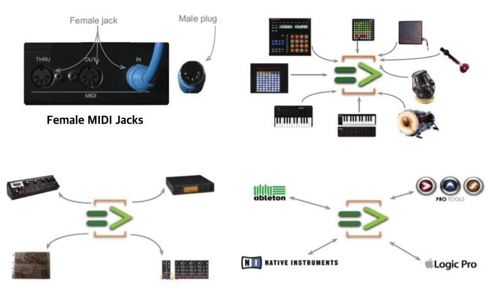
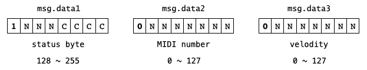
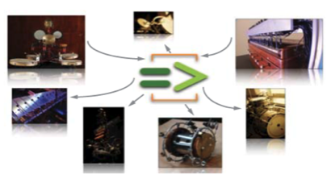
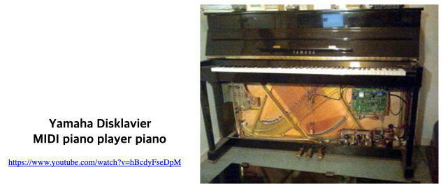

```
(c)도경구 version 0.1 (2021/11/15)
```

## 10. MIDI, OSC 등의 외부기기와 통합


참고 매뉴얼 - [클릭]()

- 라이브 연주를 위한 도구
- MIDI 컨트롤러로 외부 MIDI 기기 실시간 제어하기
- OSC(Open Sound Control) 프로토콜로 프로그램끼리 네트워크로 소통하기
- 시리얼 I/O 인터페이스


### 10-1. MIDI (Musical Instrument Digital Interface)

- MIDI 표준 제정 (1980년 대)
- 음악을 다루는 기기들끼리 소통 목적



#### MIDI 메시지




- Status Byte : `msg.data1` = `1xxxxxxx` (128\~255)
  - `NoteOff` = `1000xxxx` (128\~143)
  - `NoteOn` = `1001xxxx` (144\~159)
  - `Control` = `1011xxxx` (176\~191)  
  - `AfterTouch` = `1101xxxx` (208\~223)
  - `PitchBend` = `1110xxxx` (224\~239)
  - ...
- MIDI Number : `msg.data2` = `0xxxxxxx` (0\~127)
- Velocity : `msg.data3` = `0xxxxxxx` (0\~127)


#### Virtual MIDI Piano Keyboard

- [VMPK](https://vmpk.sourceforge.io/) 내려 받아 컴퓨터에 설치한다.
- Audicle을 켜고  Windows 메뉴에서 Device Browser을 찾아 창을 띄운다.
- Device Browser의 Source 메뉴에서 MIDI를 선택하여 VMPK와 연결된 Input/Output 연결(port) 번호를 확인한다.
- 16개 까지 동시 연결 가능하다.

#### 10-1-1. 프로그램에서 MIDI 메시지 보내 외부 키보드를 연주하기 (`MidiOut`)

- VMPK 메뉴에서 Edit>MIDI Connections 선택한다.
- MIDI Setup에서 MIDI IN Driver를 CoreMIDI로 변경한다.
- 다음 프로그램을 실행하여 무작위로 보내는 MIDI 메시지로 연주하여 소리나는지 확인한다.

```
MidiOut mout;
MidiMsg msg;
0 => int port;
if (!mout.open(port)) {
    <<< "Error: MIDI port did not open on port: ", port >>>;
    me.exit();
}

fun void sendOutMIDInote(int on, int note, int velocity) {
    if (on == 0) 128 => msg.data1; // 10000000 NoteOff
    else 144 => msg.data1; // 10010000 NoteOn
    note => msg.data2;
    velocity => msg.data3;
    mout.send(msg);
}

int note, velocity;
while (true) {
    Math.random2(60,100) => note;
    Math.random2(30,127) => velocity;
    sendOutMIDInote(1, note, velocity);
    .1::second => now;
    sendOutMIDInote(0, note, velocity);
    .1::second => now;
}
```

#### 10-1-2. 외부 키보드에서 MIDI 메시지를 프로그램으로 보내 연주하기 (`MidiIn`)


- VMPK 메뉴바에서 Edit > MIDI Connections 선택한다.
- MIDI Setup에서 MIDI OUT Driver를 CoreMIDI로 변경한다.

- 다음 프로그램을 실행하여 VMPK의 건반을 눌러 ChucK의 `StkInstrument` 악기 소리가 나는지  확인한다.

```
MidiIn min;
MidiMsg msg;     
0 => int port;
if (!min.open(port)) {
    <<< "Error: MIDI port did not open on port: ", port >>>;
    me.exit();
}

Rhodey piano => dac; 

while (true) {
    min => now; 
    while (min.recv(msg)) {
        <<< msg.data1, msg.data2, msg.data3 >>>;
        if (msg.data1 == 144) { // noteOn (144)
            Std.mtof(msg.data2) => piano.freq;
            msg.data3 / 127.0 => piano.gain;
            1 => piano.noteOn;
        }
        else { // noteOff (128)
            1 => piano.noteOff;
        }
    }
}
```

#### 10-1-3. 가상 MIDI 포트 만들어 쉬레드 끼리 MIDI 메시지를 주고 받기

- 가상 MIDI 포트 만들기
  - Mac OS
    - Audio Midi Setup at `Applications/Utilities`
    - 메뉴바에서 Window > Show MIDI Studio
    - `IAC 드라이버` 아이콘 클릭
    - `Device is online` 체크박스 선택
  - Windows
    - [loopMIDI(virtualMIDI)](https://www.tobias-erichsen.de/software/loopmidi.html) 다운 받아 설치
    - 좌하단 `+` 버튼 클릭

- 이제 miniAudicle의 MIDI Devices를 열면 가상 MIDI 포트가 보인다.
- 10-1-1 프로그램을 실행해보자.

#### 10-1-4. MIDI 메시지로 로봇 악기 제어하기



#### Yamaha Disklavier




### 10-2. OSC (Open Sound Control)

- OSC는 컴퓨터 유무선 네트워크를 통해서 프로그램 또는 외부 기기 간 음악 정보를 주고 받을 수 있는 프로코콜이다. 
- MIDI 보다 앞선 기술이라 할 수 있으며 1997년에 처음 소개되었다.
- 응용 사례 : 랩탑 오케스트라, 모바일 오케스트라, 인터랙티브 아트 등

#### 사례 학습 - 지휘자(sender) <=> 연주자(receiver)

    


## 실습 

### 1. 다음 프로그램 실행해보기

```
MidiOut mout;
0 => int port;
if (!mout.open(port)) {
    <<< "Error: MIDI port did not open on port: ", port >>>;
    me.exit();
}
MidiMsg msg;

fun void sendOutMIDInote(int on, int note, int velocity) {
    if (on == 0) 128 => msg.data1; // 10000000 NoteOff
    else 144 => msg.data1; // 10010000 NoteOn
    note => msg.data2;
    velocity => msg.data3;
    mout.send(msg);
}

[57,57,64,64,66,66,64,62,62,61,61,59,59,57] @=> int notes[];
0.3::second => dur q;
0.8::second => dur h;
[ q, q, q, q, q, q, h, q, q, q, q, q, q, h] @=> dur durs[];

while (true) 
    for (0 => int i; i < notes.cap(); i++) {
        sendOutMIDInote(1, notes[i], 100); 
        durs[i] => now;
        sendOutMIDInote(0, notes[i], 100); 
        0.2::second => now;
    }
```

### 2. 다음 프로그램 실행해보기

```
MidiIn min;
MidiMsg msg;
0 => int port;
if (!min.open(port)) {
    <<< "Error: MIDI port did not open on port: ", port >>>;
    me.exit();
}

Rhodey piano => dac;

int note, velocity;
Event press;

fun void playPiano() {
    while (true) {
        press => now;
        Std.mtof(note) => piano.freq;
        velocity / 127.0 => piano.noteOn;
    }
}

spork ~ playPiano();

while (true) {
    min => now;
    while (min.recv(msg)) {
        <<< msg.data1, msg.data2, msg.data3 >>>;
        if (msg.data1 == 144) { // noteOn
            msg.data2 => note;
            msg.data3 => velocity;
        }
        else if (msg.data1 == 128) //noteOff
            0 => velocity;
        press.signal();
    }
}
```


